---
markdown-pdf:
  format: A4
  displayHeaderFooter: false
  margin:
    top: 20mm
    right: 15mm
    bottom: 20mm
    left: 15mm
  stylesheet: "../company-profile-pdf.css"
---


---

# Accounting & Financial Management

## Complete user guide for Pindah Basa

**Finance managers. Bookkeepers. Cashiers. Sales teams. Business owners.**  
Run the full financial lifecycle — chart of accounts, journals, cash and bank, invoices, POS, fiscal periods, VAT, and IFRS-ready statements — in one connected module of **Pindah Basa**.

| | |
|---|---|
| **Product** | **Pindah Basa** — Accounting & Sales Module |
| **Publisher** | **Pindah Private Limited** |
| **Website** | [www.pindah.org](https://pindah.org) |
| **Platform** | [basa.pindah.org](https://basa.pindah.org) |
| **Contact** | [admin@pindah.org](mailto:admin@pindah.org) · +263 714 856 897 |

**Pindah Private Limited** builds **Pindah Basa**, the operating platform for organisations that have outgrown fragmented systems. Finance, operations, manufacturing, healthcare, education, and logistics share one data layer — cloud, on-premise, or hybrid — with native multi-currency (USD + ZiG), IFRS compliance at transaction level, and immutable audit trails.

Learn more at [pindah.org](https://pindah.org)

*When your operations outgrow the systems that built them.*

---

## Executive Summary

Accounting & Sales is the financial engine of **Pindah Basa**. Every monetary movement — money received from customers, money paid to suppliers and for expenses, invoices outstanding, quotations in progress, POS sales, and bank statement lines — posts as balanced double-entry journals into the general ledger.

The module is built around your **chart of accounts**. Day-to-day operators use **Point of Sale**, **Invoices**, and **Quotations**. Finance teams manage **Journals**, **Fiscal Periods**, **Trial Balance**, **Financial Statements**, **VAT Return**, and **Ledger Health**. Cash movements use **Receive Money**, **Spend Money**, and **Import Bank Statement**.

Accounting works hand in hand with **Inventory & Stock**: every POS sale and invoice line reduces stock; stock receipts update costs that feed valuation. Pharmacy dispenses can collect payment through the same sales flow. Supplier bills and supplier payments live under **Procurement**, but appear under Purchases and Payables in the Accounting menu for convenience.

Document numbers (**INV-**, **JE-**, **ORD-**, **S-**, **RX-**, and similar) are assigned at **create** time. Status (`Draft`, `Pending`, `Paid`, …) is separate — numbers do not change when you verify or post.

---

## Who This Is For

| Role | How they use Accounting |
|------|-------------------------|
| **Finance managers and accountants** | Chart of accounts, journals, fiscal periods, statements, VAT, ledger health |
| **Bookkeepers** | Daily receive/spend money, invoice payments, bank import, trial balance |
| **Cashiers and retail staff** | Point of Sale, receipt printing, sales register |
| **Sales teams** | Quotations, invoices, customers, sales orders |
| **Procurement** | Purchase orders (commitment); supplier bills/payments in Procurement |
| **Business owners** | Financial dashboard, statements, consolidation overview |

---

## Key Capabilities

- Financial dashboard with KPIs, charts, aging, and quick actions
- Full chart of accounts (tree/flat), import/export, merge, activate/deactivate
- System account mappings that drive automatic posting
- Journals with draft → post → reverse → duplicate lifecycle
- General ledger, account activity, trial balance
- Layout-driven financial statements (income statement, balance sheet, cash flow, equity)
- Fiscal years and periods (open, soft-close, close, reopen, year close, FX revaluation)
- VAT return preview and filing
- Ledger health diagnostics with one-click Fix for common gaps
- Receive Money / Spend Money cash journals
- Bank statement import (standard and AI-assisted)
- Point of Sale with till, customer, barcode, tax codes
- Invoices with real `INV-` numbers at create, payments, credit notes, reverse, email, PDF
- Quotations, sales orders, sales register, purchase orders
- Customers (clients), payment methods, banks, currencies (including RBZ rates)
- Tax codes (VAT, withholding, excise, fees)
- CoA templates and report layouts
- Consolidate — backfill missing journals from sales activity

---

## Important Concepts

| Term | Meaning |
|------|---------|
| **Chart of accounts** | Master list of accounts by type (Asset, Liability, Equity, Income, Expense) |
| **System account** | Named mapping (e.g. `CASH` → 1100) used by automatic posting |
| **Journal entry** | Balanced financial record — debits must equal credits to post |
| **Draft / Posted / Reversed** | Journal lifecycle statuses |
| **General ledger** | Every posted journal line across accounts |
| **Trial balance** | Account balances as of a date — verifies books balance |
| **Fiscal period** | Calendar window that controls whether posting is allowed |
| **Soft close** | Period restricted; only privileged users may post |
| **Hard close** | Period locked after close checklist passes |
| **Consolidate** | Creates missing journals from sales/invoices already in the system |
| **Invoice** | Customer bill — `INV-` number at create; GL posts when status leaves Draft |
| **Quotation** | Price offer before sale — no GL until invoiced |
| **Purchase order** | Supplier commitment — no stock/GL until GRN / supplier invoice |
| **POS sale** | Over-the-counter sale — stock + journals immediately |
| **Settlement account** | GL account a payment method posts into (Cash, Ecocash, Paynow, …) |
| **Ledger health** | Diagnostics: unbalanced entries, unposted docs, AR/AP/inventory recon |

---

## Menu Map (sidebar)

Open **Accounting** in the left sidebar of **Pindah Basa**.

| Section | Menu item | Route |
|---------|-----------|-------|
| Top | Dashboard | `/accounting/dashboard` |
| Top | Point of Sale | `/accounting/sales/create` |
| Top | Invoices | `/accounting/invoices` |
| **Sales and Receivables** | Customers | `/accounting/customers` |
| | Quotations | `/accounting/quotations` |
| | Sales Orders | `/accounting/orders` |
| | Sales Register | `/accounting/sales/list` |
| **Purchases and Payables** | Purchase Orders | `/accounting/purchase-orders` |
| | Supplier Bills | `/procurement/supplier-invoices` |
| | Pay Suppliers | `/procurement/payments` |
| **Cash and Bank** | Receive Money | `/accounting/cash/receive-money` |
| | Spend Money | `/accounting/cash/spend-money` |
| | Import Bank Statement | `/accounting/cash/import-statement` |
| | Bank Accounts | `/accounting/banks` |
| | Payment Methods | `/accounting/payment-methods` |
| **General Ledger** | Chart of Accounts | `/accounting/charts-of-accounts/chart-of-accounts` |
| | Journals | `/accounting/charts-of-accounts/journals` |
| | New Journal | `/accounting/charts-of-accounts/journals/new` |
| | General Ledger | `/accounting/charts-of-accounts/general-ledger` |
| | Account Activity | `/accounting/charts-of-accounts/account-activity` |
| | Fiscal Periods | `/accounting/charts-of-accounts/fiscal-periods` |
| **Reports** | Trial Balance | `/accounting/charts-of-accounts/trial-balance` |
| | Financial Statements | `/accounting/charts-of-accounts/financial-statements` |
| | VAT Return | `/accounting/charts-of-accounts/tax-return` |
| | Ledger Health | `/accounting/charts-of-accounts/ledger-health` |
| **Settings** | Currencies | `/accounting/currencies` |
| | Tax Codes | `/accounting/charts-of-accounts/tax-codes` |
| | System Accounts | `/accounting/charts-of-accounts/system-accounts` |
| | Account Types | `/accounting/charts-of-accounts/account-types` |
| | CoA Templates | `/accounting/charts-of-accounts/coa-templates` |
| | Report Layouts | `/accounting/charts-of-accounts/report-layouts` |

---

## Table of Contents

1. [Getting Started](#getting-started)
2. [Financial Dashboard](#financial-dashboard)
3. [Initial Accounting Setup](#initial-accounting-setup)
4. [Chart of Accounts](#chart-of-accounts)
5. [System Accounts](#system-accounts)
6. [Journals](#journals)
7. [General Ledger and Account Activity](#general-ledger-and-account-activity)
8. [Fiscal Periods](#fiscal-periods)
9. [Receive Money and Spend Money](#receive-money-and-spend-money)
10. [Import Bank Statement](#import-bank-statement)
11. [Banks and Payment Methods](#banks-and-payment-methods)
12. [Point of Sale](#point-of-sale)
13. [Sales Register](#sales-register)
14. [Invoices](#invoices)
15. [Quotations](#quotations)
16. [Sales Orders](#sales-orders)
17. [Purchase Orders](#purchase-orders)
18. [Customers](#customers)
19. [Currencies](#currencies)
20. [Tax Codes](#tax-codes)
21. [Trial Balance](#trial-balance)
22. [Financial Statements](#financial-statements)
23. [VAT Return](#vat-return)
24. [Ledger Health](#ledger-health)
25. [Consolidation and Month-End](#consolidation-and-month-end)
26. [How Accounting Connects to Other Modules](#how-accounting-connects-to-other-modules)
27. [Daily and Month-End Routines](#daily-and-month-end-routines)
28. [Troubleshooting](#troubleshooting)

---

## Getting Started

1. Sign in to **[basa.pindah.org](https://basa.pindah.org)**.
2. Confirm your **location / till** in the top bar (e.g. `DEFAULT_WAREHOUSE - L-10141`).
3. Open **Accounting** in the sidebar.
4. Start on the **Dashboard**.
5. If this is a new organisation, complete [Initial Accounting Setup](#initial-accounting-setup) before live transactions.

Tip: use **Ctrl+K** (global search) to jump to any Accounting screen by name.

---

## Financial Dashboard

**Path:** Accounting → Dashboard  
**URL:** `/accounting/dashboard`

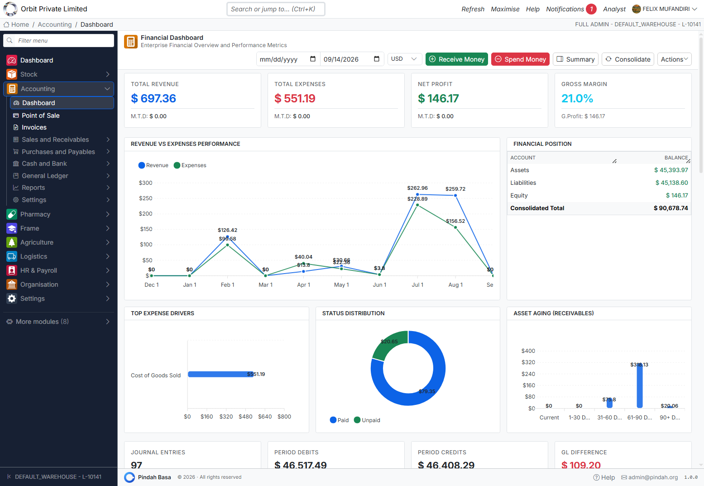

### What you see

For the selected date range and currency:

| KPI | Meaning |
|-----|---------|
| **Total Revenue** | Income in the period |
| **Total Expenses** | Costs in the period |
| **Net Profit** | Revenue minus expenses |
| **Gross Margin** | Profitability after direct costs |

Also typically shown:

- Revenue vs Expenses trend chart
- Financial position (Assets / Liabilities / Equity)
- Top expense drivers
- Invoice status distribution (paid vs unpaid)
- Receivables aging (current, 30, 60, 90+ days)
- Journal count, period debits/credits, GL difference warning when unbalanced

### Controls

| Control | Purpose |
|---------|---------|
| Date range | Filter KPIs and charts |
| Currency | Report currency (e.g. USD, ZWL) |
| **Receive Money** | Open cash receipt form |
| **Spend Money** | Open cash payment form |
| **Summary** | Condensed period summary |
| **Consolidate** | Backfill missing sales journals |
| **Actions** | Shortcuts (Import Bank Statement, statements, CoA, journals, invoices, customers, …) |

---

## Initial Accounting Setup

Complete this sequence before going live.

### Step 1 — Chart of accounts

Go to **Accounting → General Ledger → Chart of Accounts**.

- **Add account**, or **Import**, or **Initialise defaults**, or apply a **CoA Template**
- Ensure you have Cash, AR, AP, Inventory, Sales Revenue, COGS, VAT accounts as needed

### Step 2 — System accounts

Go to **Settings → System Accounts** and map at least:

| Key | Typical account |
|-----|-----------------|
| `CASH` | 1100 — Cash |
| `AR_CONTROL` | 1200 — Accounts Receivable |
| `AP_CONTROL` | 2100 — Accounts Payable |
| `INVENTORY` | 1300 — Inventory |
| `SALES_REVENUE` | 4100 — Sales Revenue |
| `COGS` | 5100 — Cost of Goods Sold |
| `VAT_OUTPUT` / `VAT_INPUT` | VAT control accounts |
| `FX_GAIN` / `FX_LOSS` | Required for FX revaluation |

Without **Cash**, Receive Money, Spend Money, and bank import commit cannot post.

### Step 3 — Fiscal year

Go to **Fiscal Periods → New fiscal year**. Set name, start date, period count, period length (Month / Quarter), and retained earnings account.

### Step 4 — Supporting masters

1. **Currencies** — base currency + FX rates (optionally retrieve from RBZ)
2. **Payment Methods** — each method needs a **Settles Into** account
3. **Tax Codes** — VAT15, EXEMPT, IMTT, WHT, etc.
4. **Banks** — bank name, account number, branch, currency
5. **Customers** — client directory

### Step 5 — Stock prerequisites

Ensure **Locations** and **Tills** exist in Stock. POS requires a till.

### Step 6 — Smoke test

1. Post a small **Spend Money** expense.
2. Run a test **POS sale**.
3. Run **Consolidate** if needed.
4. Open **Trial Balance** — debits should equal credits.
5. Open **Ledger Health** — resolve any Fail rows.

---

## Chart of Accounts

**Path:** Accounting → General Ledger → Chart of Accounts

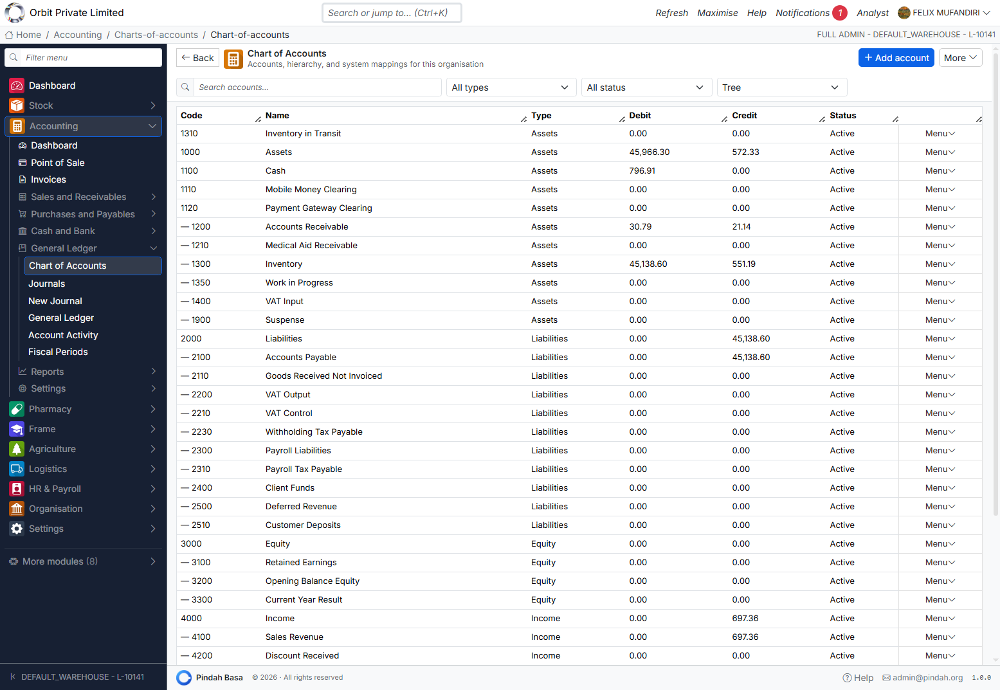

### List and filters

- Search by code or name
- Filter by **type** (Assets, Liabilities, Equity, Income, Expenses)
- Filter by **Active / Inactive**
- View as **Tree** (hierarchy) or **Flat**

Columns: Code, Name, Type, Debit, Credit, Status, Menu.

### Add / edit an account

Click **+ Add account** (or row → Edit). Fields include:

| Field | Notes |
|-------|-------|
| Code | Unique per organisation (suggested ranges: Assets 1000–1999, … Expenses 5000–7999) |
| Name | Display name |
| Type / Subtype | Must match parent type |
| Parent | Optional hierarchy |
| Cash-flow class | `CASH`, `OPERATING`, `INVESTING`, `FINANCING`, `NONE` |
| Control type | `AR`, `AP`, `INVENTORY`, `TAX`, `BANK`, `CASH`, `WIP`, `SUSPENSE` |
| Currency | Optional account currency |
| Default tax code | Optional |
| Flags | Postable, Active, Allow manual posting, Monetary, Reconcilable, Require location/department/project |

### Row actions

| Action | When to use |
|--------|-------------|
| Edit | Change name, flags, parent (type locked once journal lines exist) |
| Usage | See where the account is used (blocks unsafe delete) |
| Activate / Deactivate | Soft-retire without deleting |
| Merge | Move all lines from source → target (same type; source must have no children) |
| Delete | Only if unused |

### More menu

Import, Export, Initialise defaults, link to Templates.

---

## System Accounts

**Path:** Accounting → Settings → System Accounts

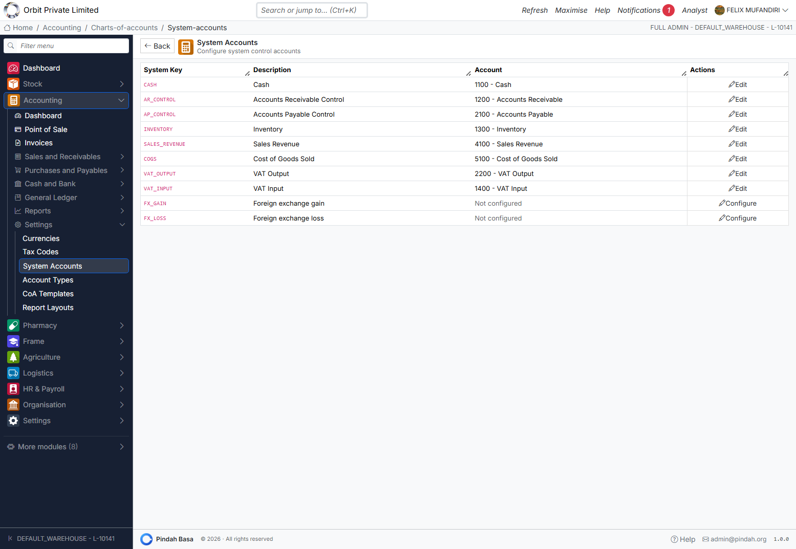

Map each **System Key** to a chart account. Keys shown as “Not configured” must be configured before the related feature works (e.g. FX revaluation needs `FX_GAIN` and `FX_LOSS`).

Use **Configure** / **Edit** / **Save** / **Cancel** per row.

---

## Journals

**Path:** Accounting → General Ledger → Journals

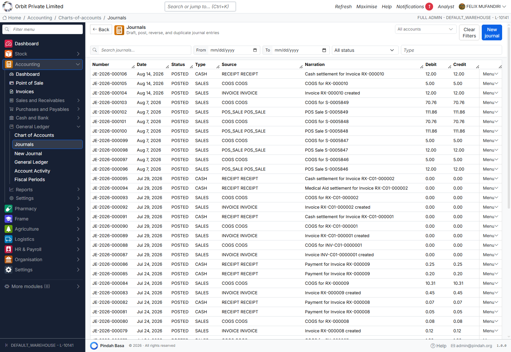

### List

Filter by account, date range, status (**Draft / Posted / Reversed**), and type. Search by number or narration.

Typical columns: Number (`JE-YYYY-######`), Date, Status, Type (`CASH`, `SALES`, `GENERAL`, …), Source, Narration, Debit, Credit, Menu.

### Row actions

| Status | Actions |
|--------|---------|
| **DRAFT** | View, Post, Duplicate, Delete |
| **POSTED** | View, Reverse, Duplicate |
| **REVERSED** | View (original voided; reversal exists) |

### New journal

**Path:** Accounting → General Ledger → New Journal

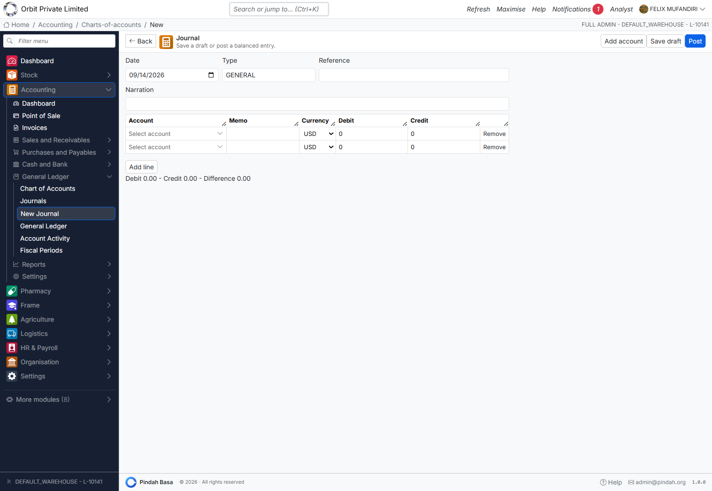

1. Set **Date**, **Type** (default `GENERAL`), **Reference**, **Narration**.
2. **Add line** for each side: Account, Memo, Currency, Debit **or** Credit.
3. Watch totals: Debit − Credit − Difference must be **0.00** to post.
4. **Save draft** (may be unbalanced until you finish) or **Post**.
5. Optional: **Add account** shortcut, **Duplicate**, **Reverse** (on existing posted journals).

Rules that block posting:

- Debits must equal credits (2 decimal places)
- Accounts must be active and postable
- A fiscal period must cover the date and must not be LOCKED
- Soft-closed / control accounts may require elevated permissions

---

## General Ledger and Account Activity

### General Ledger

**Path:** Accounting → General Ledger → General Ledger

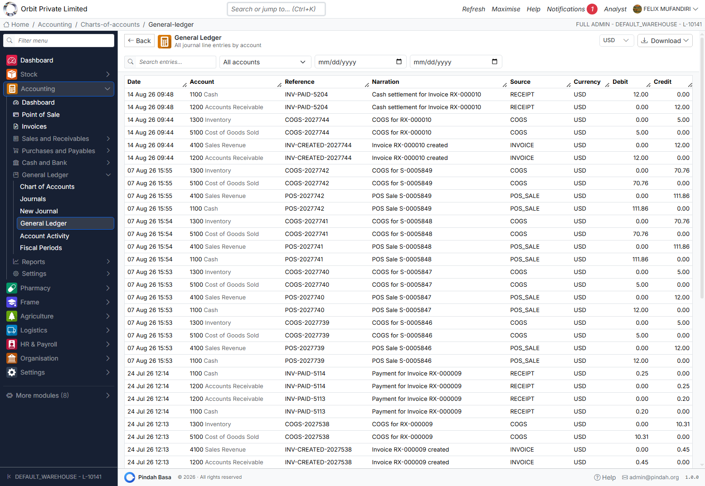

Every journal **line** by account for the selected filters. Columns include Date, Account, Reference, Narration, Source (`POS_SALE`, `INVOICE`, `RECEIPT`, `COGS`, …), Currency, Debit, Credit.

- Search entries
- Filter by account and date range
- **Download** PDF or Excel

### Account Activity

**Path:** Accounting → General Ledger → Account Activity

1. Select one account and a date range.
2. Click **Generate**.
3. Review opening balance → movements → closing balance.

Use this for bank reconciliation and audit of a single account.

---

## Fiscal Periods

**Path:** Accounting → General Ledger → Fiscal Periods

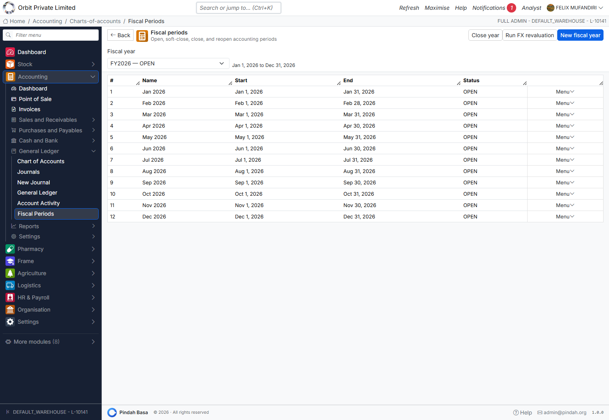

### Year header actions

| Action | Purpose |
|--------|---------|
| **New fiscal year** | Create year + monthly/quarterly periods |
| **Run FX revaluation** | Post FX gain/loss as of a date / period end |
| **Close year** | When all periods are closed — P&L sweep to retained earnings; periods become **LOCKED** |

### Period statuses

```
OPEN → SOFT_CLOSED → CLOSED → LOCKED (after year close)
         ↑ reopen with reason ↑
```

### Per-period menu

| Action | Effect |
|--------|--------|
| Checklist | Month-end readiness checks (`canClose`) |
| Run FX | FX revaluation for that period |
| Soft close | Restrict posting |
| Close | Hard close (checklist must pass) |
| Reopen | Requires a reason |

Close checklist typically checks: no open posting failures, suspense/rounding clean, entries balance, AR/AP/inventory recon, GRNI, FX reval done, no drafts.

---

## Receive Money and Spend Money

### Receive Money

**Path:** Accounting → Cash and Bank → Receive Money

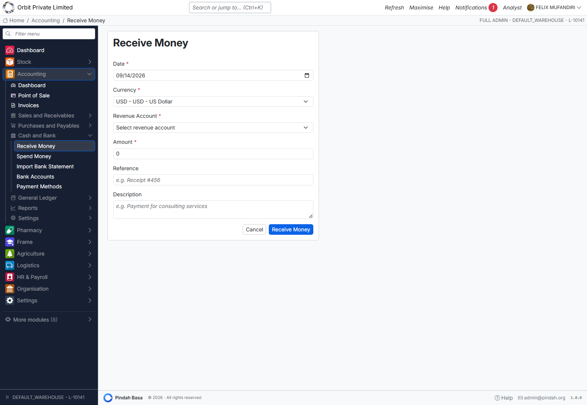

| Field | Required | Purpose |
|-------|----------|---------|
| Date | Yes | When money was received |
| Currency | Yes | Transaction currency |
| Revenue Account | Yes | Income account to credit |
| Amount | Yes | How much |
| Reference | No | Receipt / transfer ref |
| Description | No | Notes |

Click **Receive Money**. System debits **Cash** (system account) and credits the revenue account.

**Use for:** consulting fees, deposits, ad-hoc income not tied to an invoice.

### Spend Money

**Path:** Accounting → Cash and Bank → Spend Money

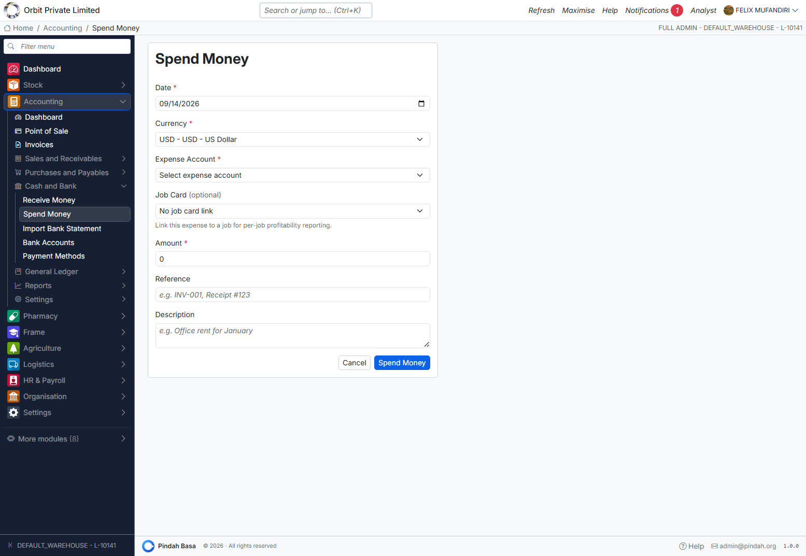

Same pattern for outflows: Expense Account, optional **Job Card** link for job profitability, Amount, Reference, Description → **Spend Money**.

**Use for:** rent, utilities, petty cash, expenses not tied to a purchase order.

---

## Import Bank Statement

**Path:** Accounting → Cash and Bank → Import Bank Statement

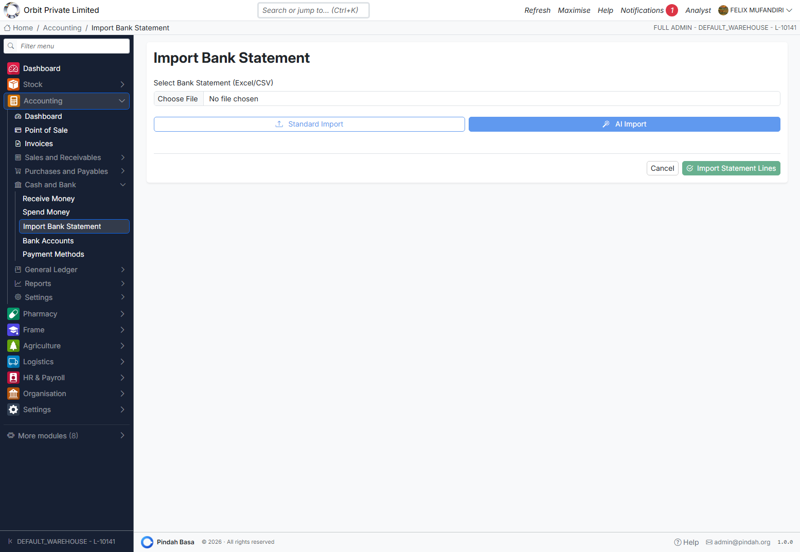

1. Choose File (Excel/CSV from your bank).
2. Pick **Standard Import** or **AI Import**.
3. Preview parsed lines (date, description, debit/credit).
4. Assign accounts to debit (expense) and credit (income) rows — apply in bulk where offered.
5. Click **Import Statement Lines** — each mapped line posts as a cash journal.
6. Review in Journals / General Ledger.

Requires the **CASH** system account.

---

## Banks and Payment Methods

### Bank Accounts

**Path:** Accounting → Cash and Bank → Bank Accounts

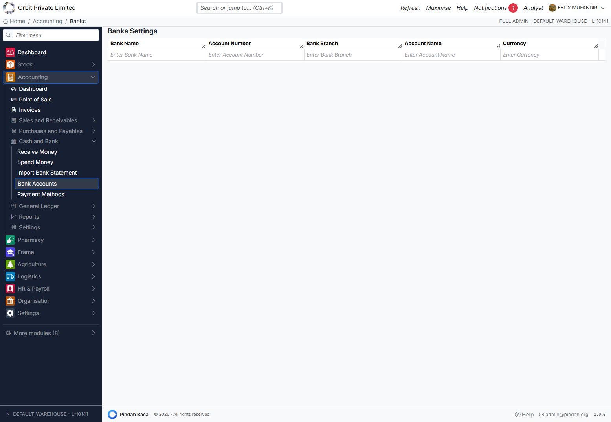

Inline master for Bank Name, Account Number, Branch, Account Name, Currency. Add a row and save; delete unused banks.

This is bank **master data** for statements — not a full reconciliation workspace. Reconciliation uses statement import + reconcilable CoA flags + Account Activity.

### Payment Methods

**Path:** Accounting → Cash and Bank → Payment Methods

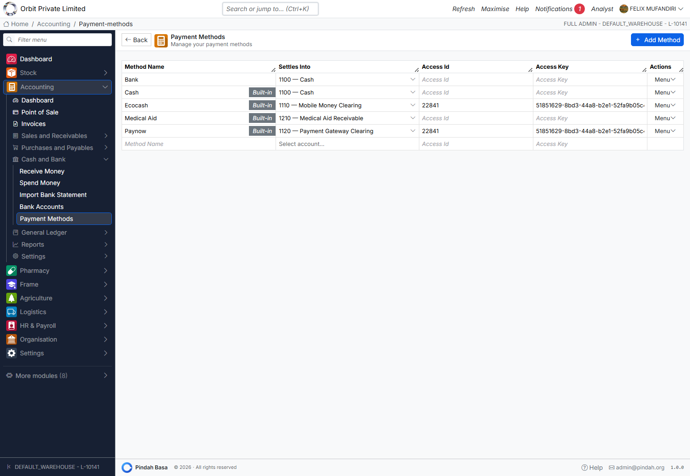

| Column | Purpose |
|--------|---------|
| Method Name | Cash, Ecocash, Paynow, Bank, Medical Aid, … |
| Settles Into | GL account the tender posts to |
| Access Id / Key | Gateway credentials where applicable |
| Built-in | System methods cannot be deleted |

Click **+ Add Method** for custom tenders. Every method used at POS must have a valid **Settles Into** account or Ledger Health will fail.

---

## Point of Sale

**Path:** Accounting → Point of Sale

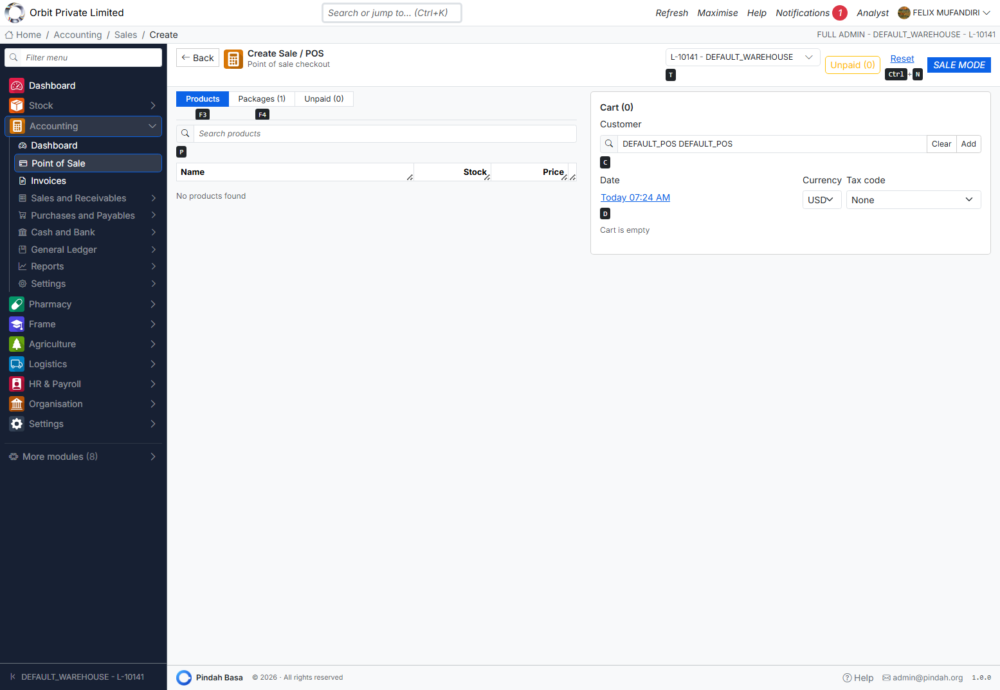

### Before you sell

1. Select **Till** / warehouse (required to load products).
2. Confirm **Customer** (default walk-in customer is fine).
3. Set **Date**, **Currency**, **Tax code**.

### Selling

1. Search products (F3) or packages (F4), or scan barcode.
2. Build the cart — adjust quantities.
3. Review totals.
4. Complete in **SALE MODE**.

**On completion:** stock reduces, receipt available, sale appears in Sales Register, journals post (`SALE_CASH` + `SALE_COST_RECOGNISED`).

### Issue / Transfer mode

From Stock menu **Issue/Transfer** or `/accounting/sales/create/transfer` — internal stock movement without a customer sale (creates a transfer request in Stock).

---

## Sales Register

**Path:** Accounting → Sales and Receivables → Sales Register

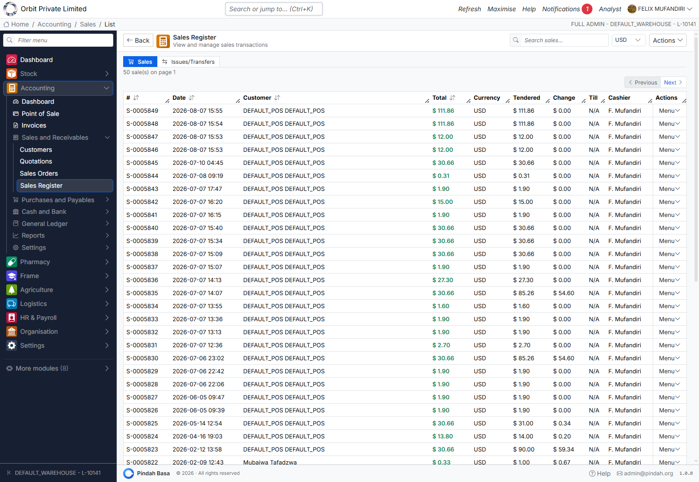

Tabs: **Sales** | **Issues/Transfers**.

Columns typically include sale number (`S-########`), Date, Customer, Total, Currency, Tendered, Change, Till, Cashier, Menu.

Open a sale for line detail, payment, and linked documents. Download or email receipts from the sale view.

---

## Invoices

**Path:** Accounting → Invoices

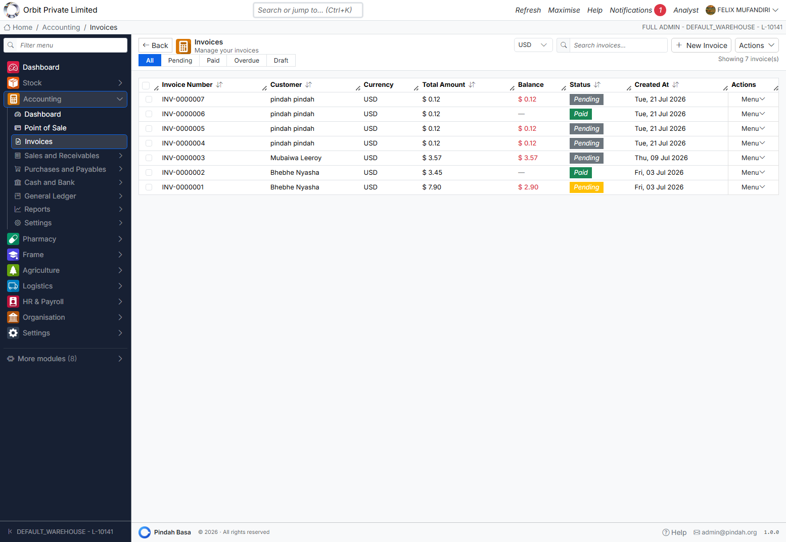

### List filters

Tabs: **All | Pending | Paid | Overdue | Draft**

Also filter by currency and search. Invoice numbers look like `INV-0000007`.

### Row / Actions menu

| Action | Purpose |
|--------|---------|
| View / Edit | Open invoice |
| Download PDF / Receipt | Customer documents |
| Duplicate | Copy as new invoice (new number) |
| Make Payment | Record receipt against balance |
| Email Invoice | Send to customer |
| Reverse Invoice | Cancel with accounting reversal |
| Issue Credit Note | Credit note document |
| Delete | Draft / permitted cases |
| Extract Fields / Import Invoices | Bulk tools under **Actions** |

### Create invoice

**Path:** Accounting → Invoices → New Invoice

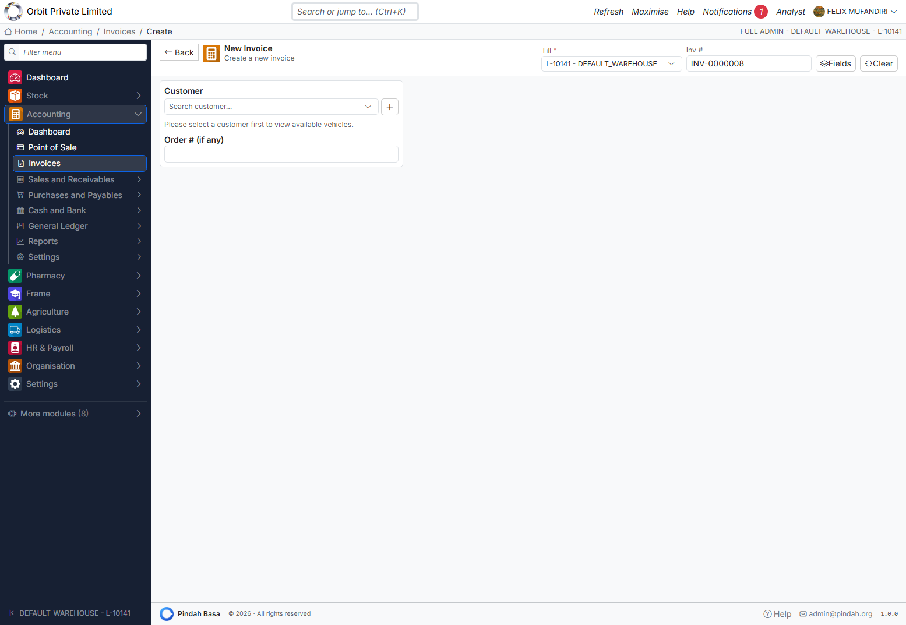

1. Confirm **Till**.
2. Note the **Inv #** — assigned immediately (e.g. `INV-0000008`). Do not expect this number to change later.
3. Select **Customer** (Add Customer if needed).
4. Optional vehicle / order link.
5. Add **line items** (products or free-text), quantities, prices, tax.
6. Set status: leave as **Draft** to hold without GL, or non-Draft to post revenue/COGS.
7. **Preview**, then **Create**.
8. Later: **Make Payment**, **Email**, **Recurring**, credit note / reverse as needed.

**GL rule:** Draft invoices do **not** hit the ledger. Leaving Draft posts `SALE_INVOICED` (+ COGS). Payments post `SALE_PAYMENT_RECEIVED`.

---

## Quotations

**Path:** Accounting → Sales and Receivables → Quotations

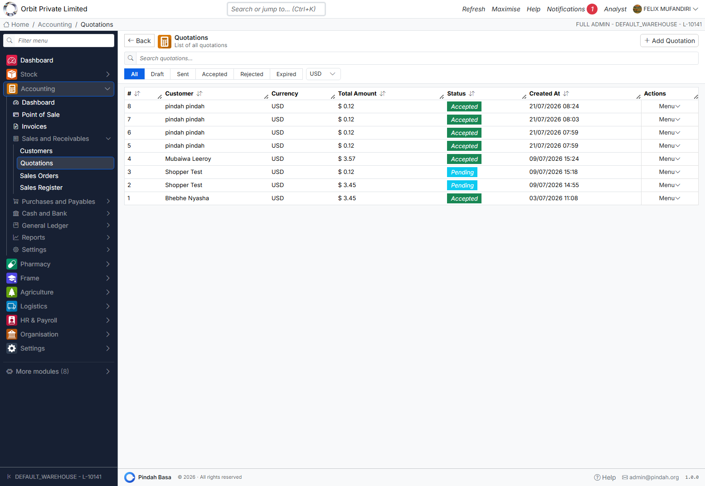

### Status filters

**All | Draft | Sent | Accepted | Rejected | Expired**

### Workflow

```
Draft → Sent/Pending → Accepted or Rejected (or Expired)
```

1. Click **+ Add Quotation**.
2. Select customer and line items.
3. Save as Draft while preparing; send PDF/email when ready.
4. Mark **Accepted** or **Rejected**.
5. Convert accepted quotes to invoices / orders as your process requires.

Quotations do **not** post to the GL until invoiced.

---

## Sales Orders

**Path:** Accounting → Sales and Receivables → Sales Orders

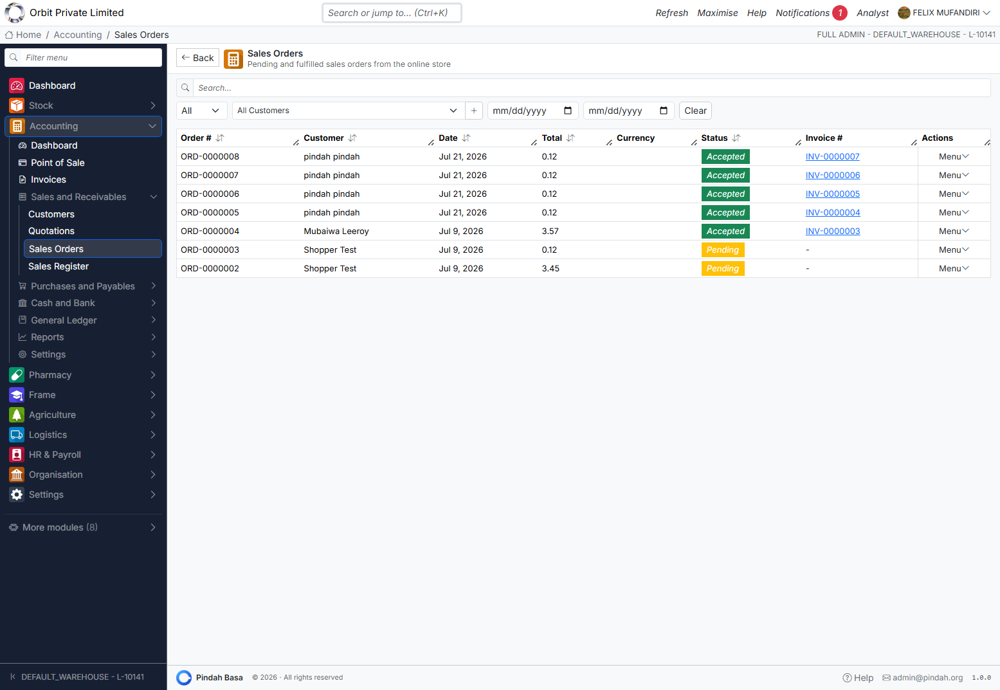

Filter by status (**All / Pending / Accepted / Rejected**), customer, and date range.

| Action | Purpose |
|--------|---------|
| View | Order detail |
| Fulfill | Fulfil pending order (stock + invoice path) |
| Reject | Decline pending order |
| View Invoice | Open linked `INV-` when created |
| Dispense script | Pharmacy script orders |

Order numbers look like `ORD-########`.

---

## Purchase Orders

**Path:** Accounting → Purchases and Payables → Purchase Orders

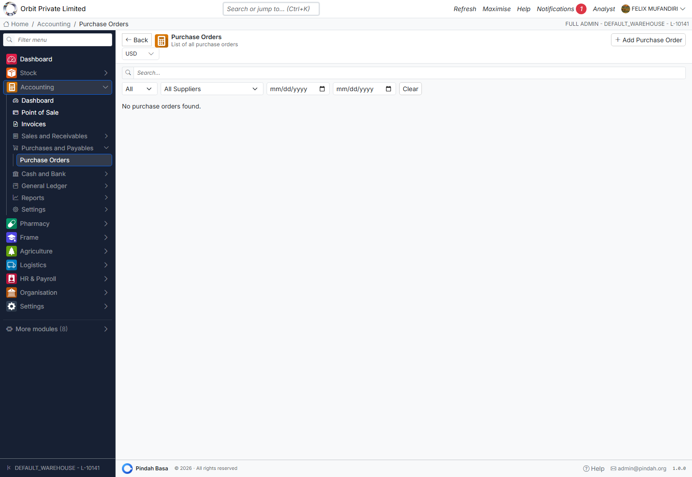

1. **+ Add Purchase Order** — supplier, lines, currency.
2. Status: **Draft → Pending** (Send) → **Accepted / Rejected**.
3. View / Download PDF.
4. Delete only while Draft.

A PO is a **commitment**, not a stock receipt. Goods receipt (GRN) and supplier invoice approval in Stock / Procurement create the GL (`GOODS_RECEIVED`, `SUPPLIER_INVOICE_APPROVED`).

Supplier Bills and Pay Suppliers open the **Procurement** module from the same menu group.

---

## Customers

**Path:** Accounting → Sales and Receivables → Customers

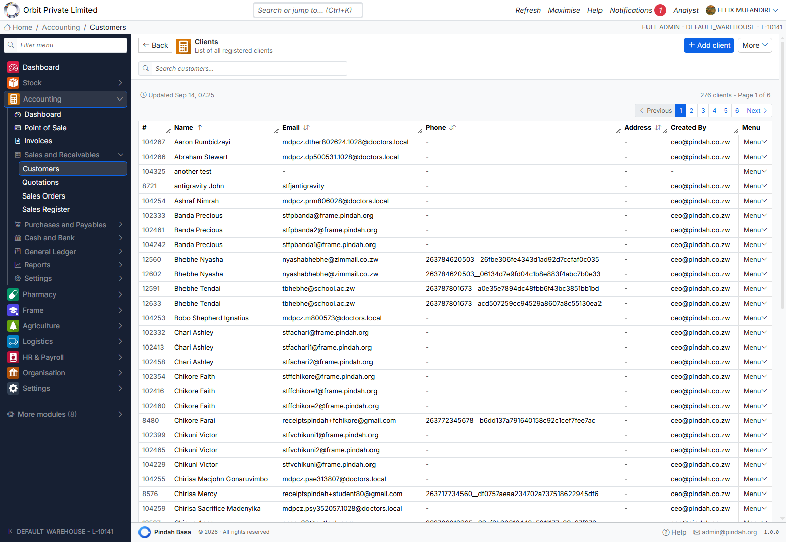

The screen title is **Clients**.

| Action | Purpose |
|--------|---------|
| + Add client | New customer |
| Search | Find by name / email / phone |
| More | Import Clients, Import Patients, Export |
| Row Menu | Edit, Delete, View Vehicles |
| View All Vehicles | Fleet / vehicle register (where used) |

---

## Currencies

**Path:** Accounting → Settings → Currencies

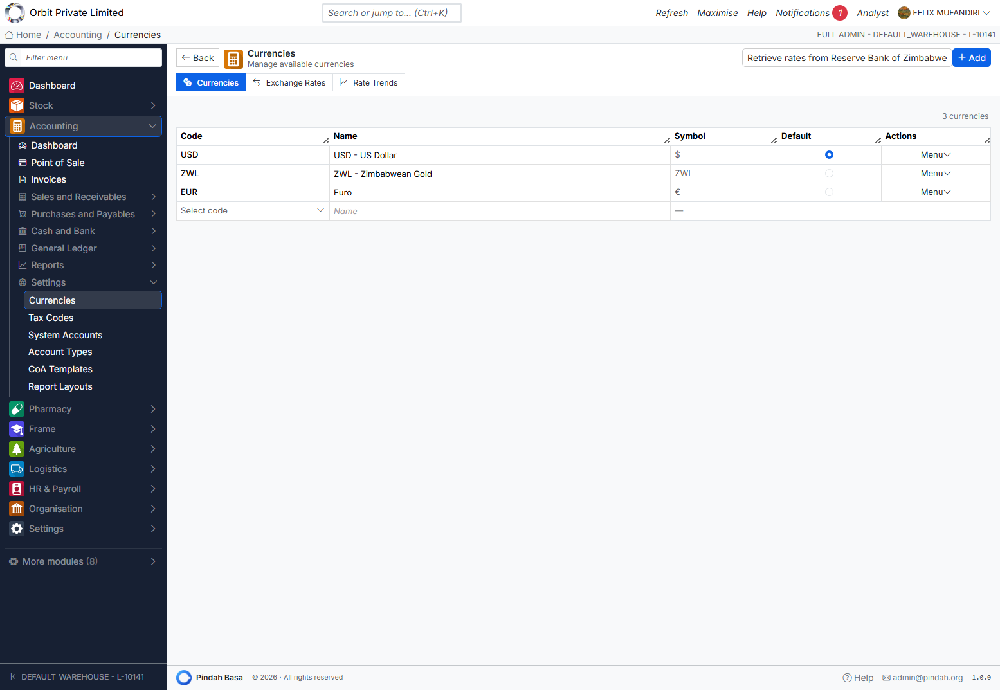

Tabs: **Currencies | Exchange Rates | Rate Trends**

- Add currencies (USD, ZWL / ZiG, EUR, …)
- Mark one as **default**
- Maintain exchange rates manually, or **Retrieve rates from Reserve Bank of Zimbabwe** and Apply
- Review rate trends for FX monitoring

---

## Tax Codes

**Path:** Accounting → Settings → Tax Codes

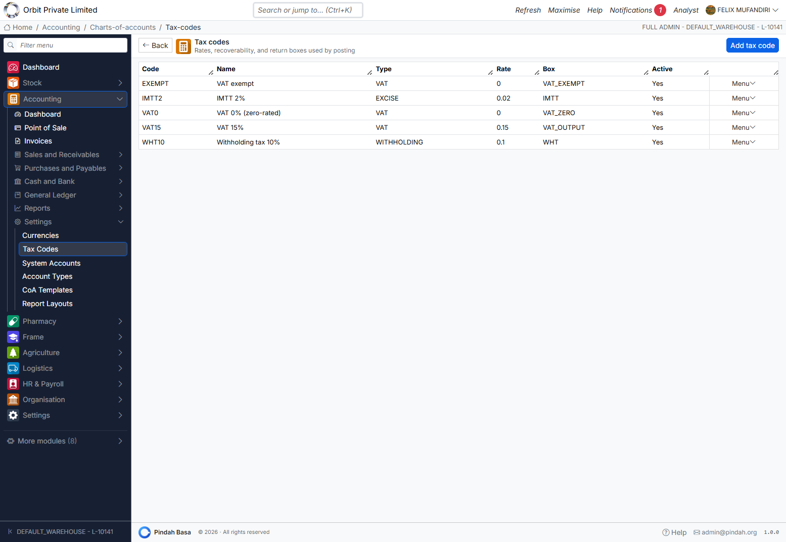

| Column | Example |
|--------|---------|
| Code | `VAT15`, `EXEMPT`, `IMTT2`, `WHT10` |
| Type | `VAT`, `WITHHOLDING`, `EXCISE`, `FEE` |
| Rate | e.g. 0.15 |
| Box | Reporting box for VAT return |
| Active | Yes / No |

**Add tax code** to define rate, jurisdiction, output/input/expense accounts, effective dates, recoverable flag. Used by POS, invoices, and posting.

---

## Trial Balance

**Path:** Accounting → Reports → Trial Balance

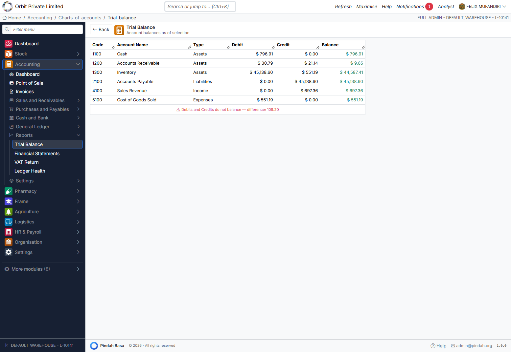

1. Set **As of** date and currency.
2. Click **Refresh**.
3. Review Code, Account Name, Type, Debit, Credit, Balance.
4. If the banner shows **Debits and Credits do not balance**, open **Ledger Health** and **Journals** to find unbalanced drafts or failed posts.

---

## Financial Statements

**Path:** Accounting → Reports → Financial Statements

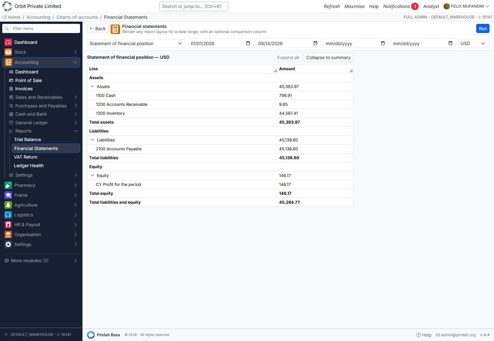

1. Choose a **layout**:
   - Statement of financial position (`BS_IFRS_CLASSIFIED`)
   - Income statement IFRS / Simple (`IS_IFRS_DEFAULT`, `IS_SIMPLE`)
   - Cash flow direct / indirect
   - Statement of changes in equity
2. Set date range (and optional **compare** range).
3. Choose currency → **Run**.
4. Use **Expand all** / **Collapse to summary**.

Layouts are managed under **Settings → Report Layouts** (preview, clone defaults to organisation copy).

---

## VAT Return

**Path:** Accounting → Reports → VAT Return

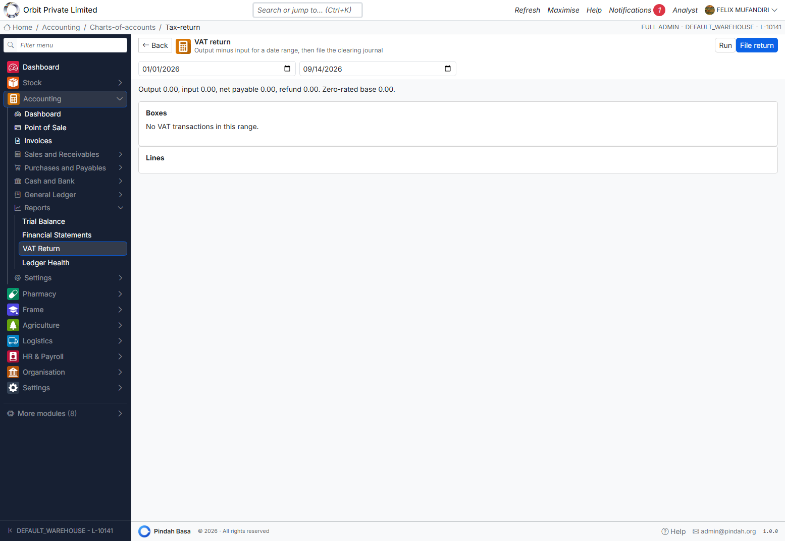

1. Set date range → **Run**.
2. Review Output, Input, Net payable / Refund, boxes, and lines.
3. When ready, **File return** — posts the clearing journal (`TAX_RETURN_FILED`). Cannot double-file the same period.

---

## Ledger Health

**Path:** Accounting → Reports → Ledger Health

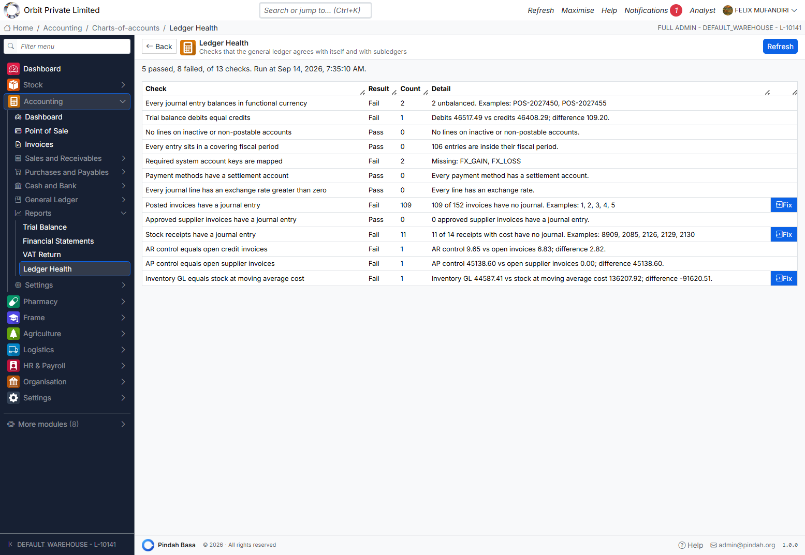

Click **Refresh**. Each check shows Pass / Fail, count, and detail.

Common Fail examples and what to do:

| Check | Typical fix |
|-------|-------------|
| Unbalanced journal entries | Reverse/correct listed POS or journal numbers |
| Trial balance imbalance | Same — find the difference amount |
| Missing system keys | Map on System Accounts |
| Unposted invoices | Click **Fix** (backfill journals) |
| Unposted GRN / stock receipts | Click **Fix** |
| AR / AP / Inventory recon | Investigate control vs subledger; Fix inventory where offered |

Treat Ledger Health as the month-end triage board before soft/hard close.

---

## Consolidation and Month-End

### Consolidate

From the Financial Dashboard **Consolidate** action:

- Scans sales and invoices missing journals
- Posts missing GL entries
- Use after imports, historical data, or when Ledger Health shows unposted documents

### Month-end checklist

1. Post or delete all **Draft** journals.
2. Run **Consolidate** and clear **Ledger Health** Fail rows (use Fix where available).
3. Import and map any remaining bank statements.
4. Run **FX revaluation** if multi-currency.
5. Review **Trial Balance** (must balance).
6. Run **Financial Statements**.
7. Soft-close the period → after final checks, **Close**.
8. File **VAT Return** for the tax period when due.
9. At year end: close all periods → **Close year**.

---

## How Accounting Connects to Other Modules

| Module | Connection |
|--------|------------|
| **Stock** | POS/invoices reduce stock; GRN posts inventory; Issue/Transfer moves stock |
| **Procurement** | Supplier invoices & payments post AP; linked from Purchases and Payables menu |
| **Pharmacy** | Dispense can create sales/invoices; same GL |
| **HR & Payroll** | Payroll approve/pay posts expense and cash journals |
| **Projects / Job Cards** | Spend Money can link expenses to jobs |
| **Organisation** | Roles and permissions gate Accounting screens |

### Automatic posting events (reference)

| Business event | Typical GL effect |
|----------------|-------------------|
| POS sale | Dr settlement / Cr revenue (+ VAT); Dr COGS / Cr inventory |
| Invoice (non-Draft) | Dr AR / Cr revenue (+ VAT); COGS as applicable |
| Invoice payment | Dr cash/bank / Cr AR |
| Credit note / reverse | Reverses sale economics |
| Goods received | Dr inventory / Cr GRNI |
| Supplier invoice approved | Dr GRNI (+ VAT in) / Cr AP |
| Supplier payment | Dr AP / Cr bank |
| Tax return filed | Clears VAT output/input into control |
| Year close | Closes P&L to retained earnings |

---

## Daily and Month-End Routines

### Daily

1. Open tills; process **POS** sales.
2. Raise / send **invoices** and **quotations**.
3. **Receive Money** / **Spend Money** for ad-hoc cash.
4. Record invoice **payments**.
5. Glance at **Dashboard** and any **Ledger Health** failures.

### Weekly

1. Import bank statements and map lines.
2. Fulfil **sales orders**.
3. Follow up overdue invoices (Overdue tab).
4. Review journals for unexpected drafts.

### Month-end

Follow [Consolidation and Month-End](#consolidation-and-month-end).

---

## Troubleshooting

| Situation | What to do |
|-----------|------------|
| Cannot Receive/Spend Money | Map **CASH** on System Accounts |
| POS shows “Select a till” / no products | Choose till; confirm stock at that location |
| Invoice has no journal | Leave Draft → Pending/Paid, or run Consolidate / Ledger Health **Fix** |
| Trial balance does not balance | Ledger Health → unbalanced journals; reverse/repost |
| Period will not close | Open Checklist; clear drafts, failures, recon gaps |
| Payment method fails health check | Set **Settles Into** account |
| FX revaluation fails | Configure `FX_GAIN` and `FX_LOSS` |
| Bank import commit fails | Ensure Cash system account + accounts assigned on lines |
| Wrong invoice number expected later | Numbers are final at create — use Status, do not re-mint |
| Supplier bill not in Accounting | Use Purchases → Supplier Bills (Procurement) |

---

## Support

- In-app **Help** and Guides (module key `accounting`)
- Email [admin@pindah.org](mailto:admin@pindah.org)
- Web [pindah.org](https://pindah.org)
- Platform [basa.pindah.org](https://basa.pindah.org)

**Pindah Basa** · Accounting & Financial Management · © Pindah Private Limited
