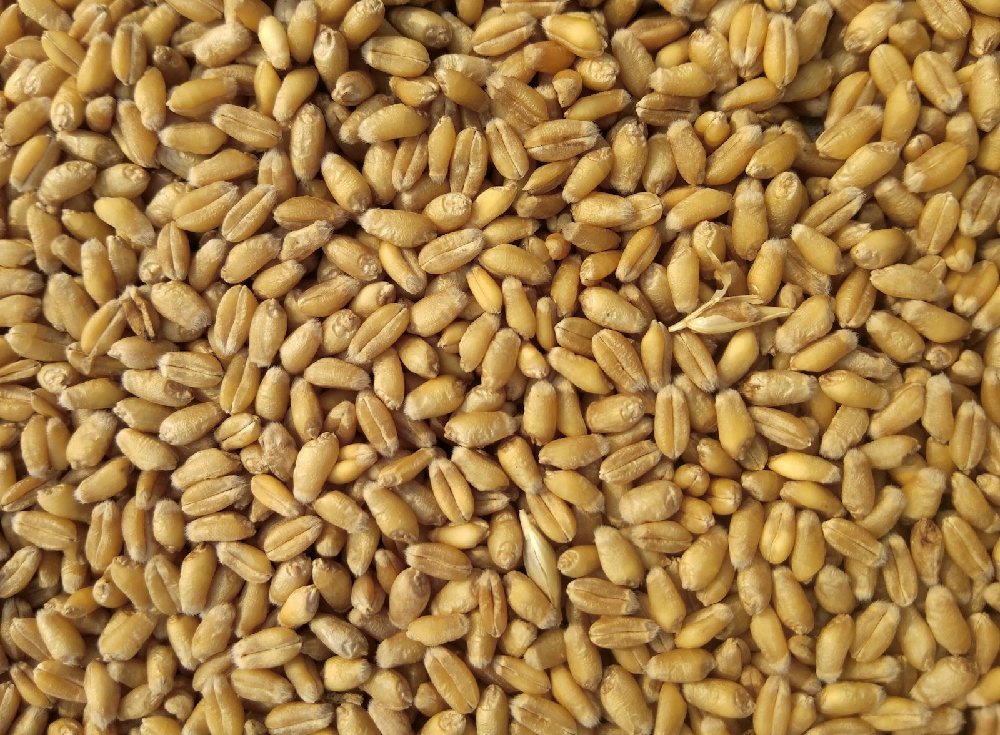
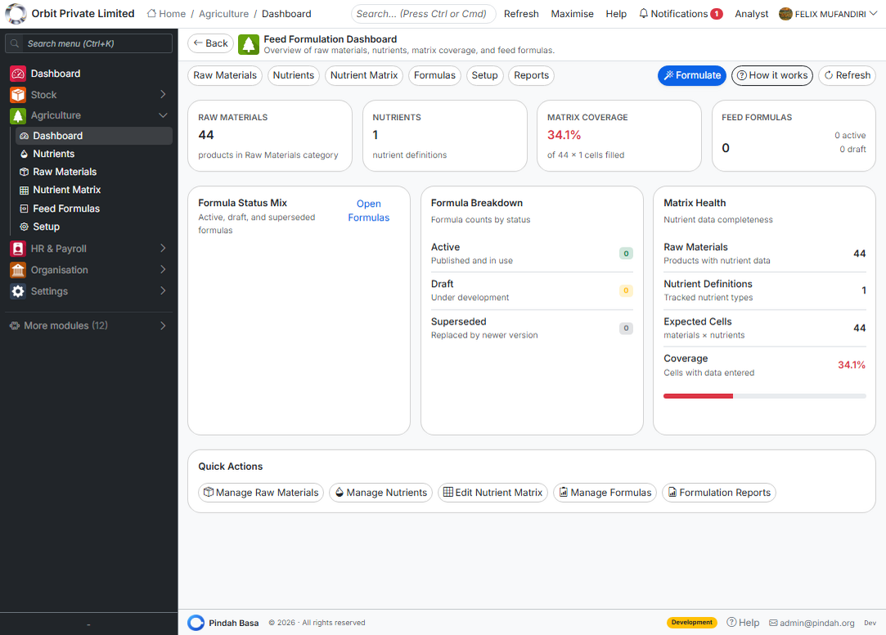
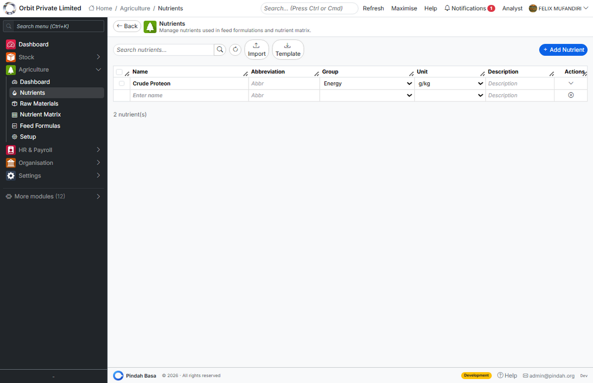
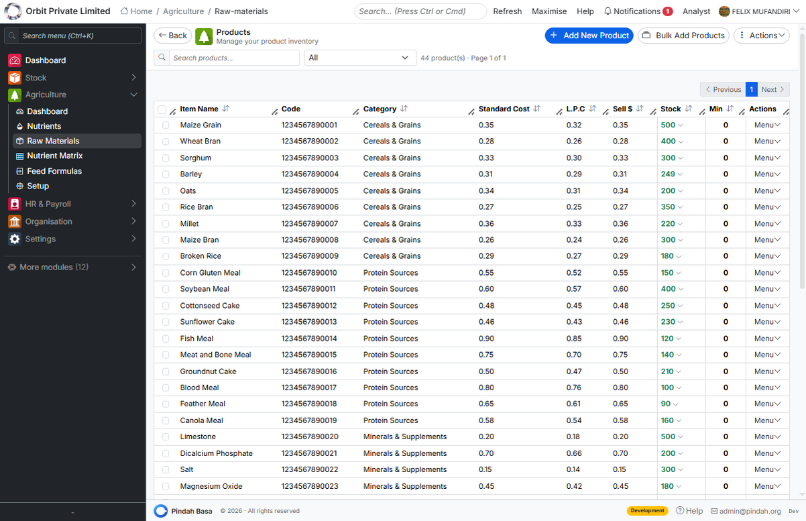
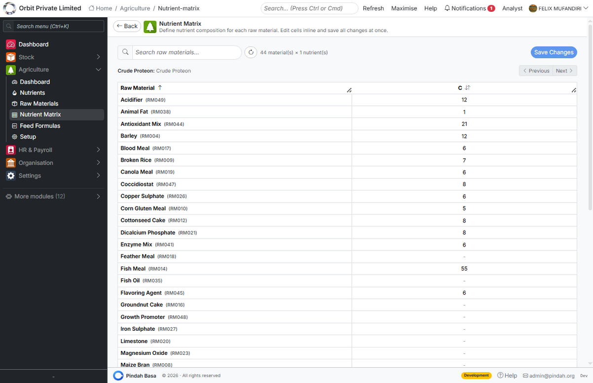
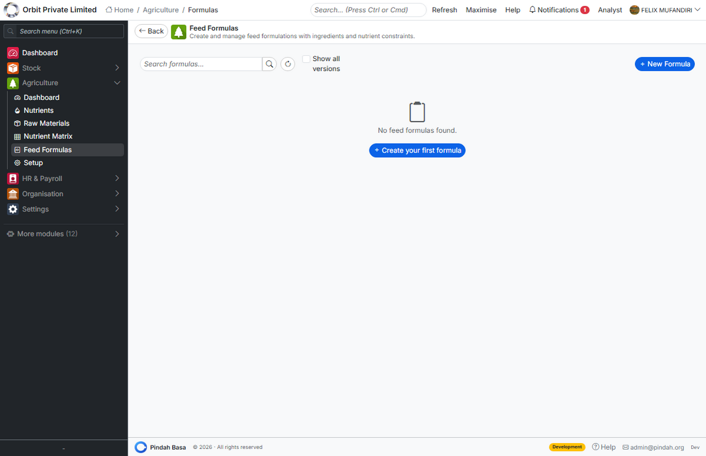
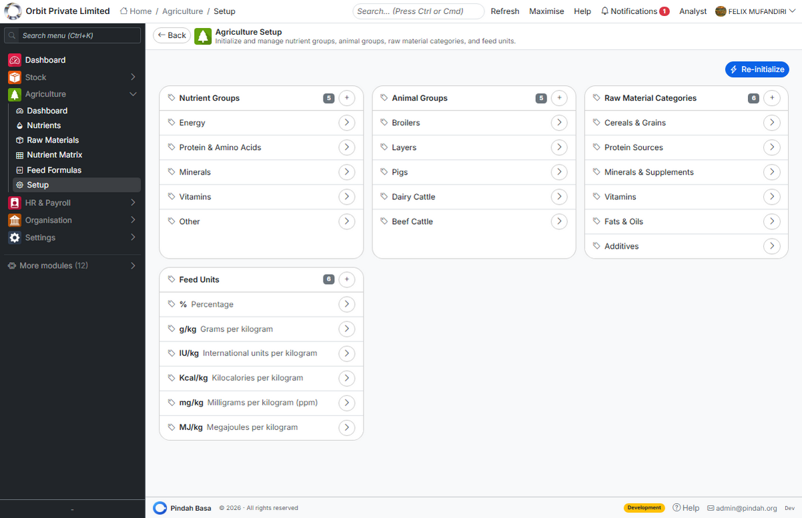

---

# Agriculture & Feed

## Precision feed formulation on Pindah Basa

**Nutritionists. Feed millers. Production planners. Quality teams.**  
Define nutrients and raw materials, build nutrient matrices, design cost-optimised feed formulas, and keep recipes aligned with nutritional targets — in one connected module of **Pindah Basa**.

| | |
|---|---|
| **Product** | **Pindah Basa** — Agriculture & Feed Module |
| **Publisher** | **Pindah Private Limited** |
| **Website** | [www.pindah.org](https://pindah.org) |
| **Platform** | [basa.pindah.org](https://basa.pindah.org) |

**Pindah Private Limited** builds **Pindah Basa**, the operating platform for organisations that have outgrown fragmented systems. Finance, operations, manufacturing, healthcare, education, and logistics share one data layer — cloud, on-premise, or hybrid — with multi-currency support and compliance built in.

Learn more at [pindah.org](https://pindah.org) - Contact [admin@pindah.org](mailto:admin@pindah.org)

*When your operations outgrow the systems that built them.*

---

## Executive Summary

Agriculture & Feed supports feed manufacturers and agricultural nutrition teams. Define nutrients and raw materials, build nutrient matrices, design feed formulas, and optimise recipes for cost and nutritional targets — all within **Pindah Basa** from **Pindah Private Limited**.

---

## Who This Is For

- Feed formulation specialists
- Nutritionists and quality teams
- Production planners sourcing raw materials
- Agricultural operations managers

---

## Key Capabilities

- Agriculture dashboard
- Nutrients catalogue
- Raw materials
- Nutrient matrix
- Feed formulas and ingredients
- Agriculture setup

---

## Table of Contents

1. [Getting Started](#getting-started)
2. [Nutrients](#nutrients)
3. [Raw Materials](#raw-materials)
4. [Nutrient Matrix](#nutrient-matrix)
5. [Feed Formulas](#feed-formulas)
6. [Setup](#setup)

---

## Getting Started

Open **Agriculture** in the sidebar of **Pindah Basa**. The **Dashboard** summarises active formulas and material usage.

---

## Nutrients

Define the nutritional components you track — protein, minerals, vitamins, and other metrics — under **Agriculture → Nutrients**.

---

## Raw Materials

List ingredients and commodities under **Raw Materials**. Each material carries cost and nutritional contribution used in formulas.

---

## Nutrient Matrix

The **Nutrient Matrix** shows how each raw material contributes to each nutrient. Keep this matrix accurate for reliable formulation.

---

## Feed Formulas

### Creating a formula

1. Go to **Agriculture → Feed Formulas**.
2. Create a new formula with target species or product type.
3. Add ingredients and percentages.
4. Review total nutrients against targets.
5. Adjust ingredients or run optimisation if available.

Save approved formulas for production and costing.

---

## Setup

Configure base units, defaults, and organisation-specific rules under **Agriculture → Setup** before building formulas at scale.

---

## About Pindah

**Pindah Private Limited** - Harare, Zimbabwe  
Enterprise software for Zimbabwe and Southern Africa — ERP, CRM, healthcare, education, manufacturing, logistics, and more.

- Website: [https://pindah.org](https://pindah.org)
- Platform: [https://basa.pindah.org](https://basa.pindah.org)
- Email: [admin@pindah.org](mailto:admin@pindah.org)
- WhatsApp: +263 714 856 897
