---
markdown-pdf:
  format: A4
  displayHeaderFooter: false
  margin:
    top: 20mm
    right: 15mm
    bottom: 20mm
    left: 15mm
  stylesheet: "../company-profile-pdf.css"
---

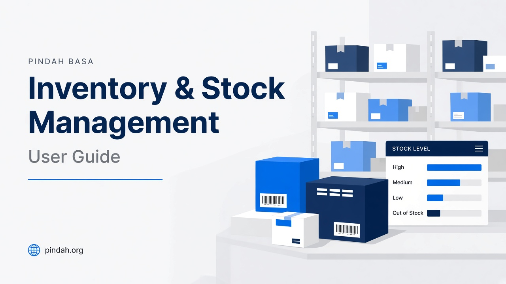

---

# Inventory & Stock Management

## Complete user guide for Pindah Basa

**Warehouse staff. Store managers. Inventory controllers. Procurement. Finance.**  
Know what you have, where it is, and how it moved — catalogue, receipts, transfers, stock takes, pricing, and reports in one connected module of **Pindah Basa**.

| | |
|---|---|
| **Product** | **Pindah Basa** — Inventory & Stock Module |
| **Publisher** | **Pindah Private Limited** |
| **Website** | [www.pindah.org](https://pindah.org) |
| **Platform** | [basa.pindah.org](https://basa.pindah.org) |
| **Contact** | [admin@pindah.org](mailto:admin@pindah.org) · +263 714 856 897 |

**Pindah Private Limited** builds **Pindah Basa**, the operating platform for organisations that have outgrown fragmented systems. Stock, accounting, pharmacy, and procurement share one data layer — multi-location quantities, FEFO batches where used, and valuation that feeds the general ledger.

Learn more at [pindah.org](https://pindah.org)

*When your operations outgrow the systems that built them.*

---

## Executive Summary

Inventory & Stock answers three questions at all times: **what do we have**, **where is it**, and **how did it move**.

From this module you manage the product catalogue, categories, warehouses and stores, suppliers, purchase receipts (goods receiving), transfers between branches, physical stock takes, markup rules and price approvals, POS tills, packages, and movement reports. Every sale in Accounting, every pharmacy dispense, and every stock receipt that posts to GL flows through these records.

The **Stock Dashboard** shows carrying value (IAS 2), stock health, receipts vs issues, reorder proposals, and NRV / dead-stock candidates — filterable by location.

---

## Who This Is For

| Role | How they use Stock |
|------|--------------------|
| **Warehouse staff** | Receive goods, pick transfers, stock takes |
| **Store managers** | Monitor levels, approve prices, review reports |
| **Inventory controllers** | Catalogue, reorder levels, audit movements |
| **Procurement** | Suppliers, stock receipts / orders |
| **Cashiers** | Tills linked to locations (sales in Accounting POS) |
| **Finance** | Valuation, movement reports, costs feeding GL |

---

## Key Capabilities

- Stock dashboard with KPIs, health, reorder and NRV insights
- Full product catalogue with bulk add, barcodes, categories
- Categories (hierarchical), suppliers, locations, units, pack sizes
- Stock receipts / purchase orders (Draft → Pending → Partial → Received)
- Stock takes with progress, variances, In Progress / Completed / Cancelled
- Stock transfers (Request → approval → in transit → received / completed)
- Issue/Transfer for internal issues (via Accounting POS transfer mode)
- Markup rules (Global, Category, Supplier, Product priority)
- Price change approvals queue
- Product packages (bundles for quick sales)
- Till management per location
- Reports: item movements, purchases, sales, issues, summary by item / customer

---

## Important Concepts

| Term | Meaning |
|------|---------|
| **Product** | Item you buy, stock, and sell — name, code, category, costs, sell price, reorder level |
| **Location** | Warehouse, store, or stock point; quantities are per location |
| **Till** | POS terminal tied to a location (e.g. `L-10141`) |
| **Stock receipt / Order** | Supplier receipt progressing Draft → Pending → Partial → Received |
| **Markup rule** | Formula for sell price from cost; priority Product → Supplier → Category → Global |
| **Price change request** | Proposed price awaiting manager approval |
| **Stock take** | Physical count vs system quantities; variance report |
| **Stock transfer** | Controlled move between locations |
| **Package** | Bundle of products sold together at POS |
| **FEFO / batch** | Earliest-expiry-first (pharmacy / perishables) |
| **Carrying value** | Inventory valuation (IAS 2) on the dashboard |

---

## Menu Map (sidebar)

Open **Stock** in the left sidebar of **Pindah Basa**.

| Menu item | Route |
|-----------|-------|
| Dashboard | `/stock/dashboard` |
| Inventory | `/stock/inventory/list` |
| Packages | `/stock/inventory/packages` |
| Stock Takes | `/stock/stocktakes` |
| Categories | `/stock/categories` |
| Suppliers | `/stock/suppliers` |
| Locations | `/stock/locations` |
| Units | `/stock/units` |
| Pack Sizes | `/stock/pack-sizes` |
| Tills | `/stock/tills` |
| Orders | `/stock/orders` |
| Transfers | `/stock/transfers` |
| Issue/Transfer | `/accounting/sales/create/transfer` |
| Markup Rules | `/stock/inventory/markups` |
| Price Approvals | `/stock/inventory/price-approvals` |
| Reports | `/stock/reports` |

---

## Table of Contents

1. [Getting Started](#getting-started)
2. [Stock Dashboard](#stock-dashboard)
3. [Products (Inventory)](#products-inventory)
4. [Packages](#packages)
5. [Categories](#categories)
6. [Suppliers](#suppliers)
7. [Locations](#locations)
8. [Units and Pack Sizes](#units-and-pack-sizes)
9. [Tills](#tills)
10. [Stock Receipts (Orders)](#stock-receipts-orders)
11. [Stock Transfers](#stock-transfers)
12. [Issue / Transfer](#issue--transfer)
13. [Stock Takes](#stock-takes)
14. [Markup Rules](#markup-rules)
15. [Price Approvals](#price-approvals)
16. [Reports](#reports)
17. [How Stock Connects to Other Modules](#how-stock-connects-to-other-modules)
18. [Setup Guide for New Organisations](#setup-guide-for-new-organisations)
19. [Daily and Monthly Routines](#daily-and-monthly-routines)
20. [Troubleshooting](#troubleshooting)

---

## Getting Started

1. Sign in to **[basa.pindah.org](https://basa.pindah.org)**.
2. Confirm **location / till** in the top bar.
3. Open **Stock** in the sidebar → **Dashboard**.
4. For first-time setup, follow [Setup Guide for New Organisations](#setup-guide-for-new-organisations).

Tip: **Ctrl+K** jumps to any Stock screen by name.

---

## Stock Dashboard

**Path:** Stock → Dashboard  
**URL:** `/stock/dashboard`

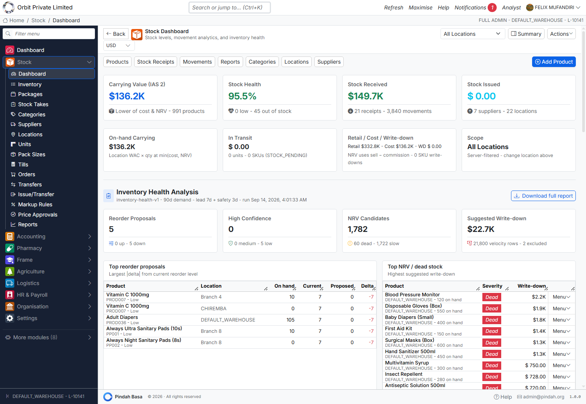

### What you see

| Metric | Meaning |
|--------|---------|
| **Carrying Value (IAS 2)** | Inventory valuation and product count |
| **Stock Health** | % healthy; out-of-stock count |
| **Stock Received** | Value / receipts / movements in period |
| **Stock Issued** | Issues / suppliers / locations context |
| **On-hand / In transit / Retail vs cost** | Position and retail comparison |
| **Inventory Health Analysis** | Reorder proposals, NRV / dead stock, suggested write-down |

### Controls

| Control | Purpose |
|---------|---------|
| Location filter | Scope to one branch or All Locations |
| **Summary** | Condensed view |
| **Actions** | Add Product, Receive Stock, Transfer Stock, View Products, Reports, Download Health Report |
| Tabs | Products, Stock Receipts, Movements, Reports, Categories, Locations, Suppliers |

Tables at the bottom highlight **Top reorder proposals** and **Top NRV / dead stock** with row menus.

---

## Products (Inventory)

**Path:** Stock → Inventory  
**URL:** `/stock/inventory/list`

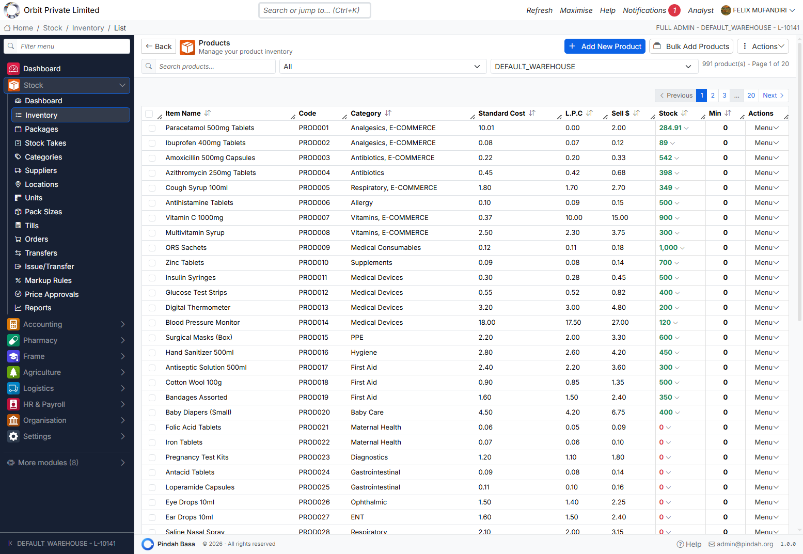

### List

Shows name, code (`PROD…`), category, Standard Cost, L.P.C. (last purchase cost), Sell $, Stock (green / red for zero), Min (reorder), Menu.

Filter by search, category, and warehouse. Paginate large catalogues.

### Header actions

| Action | Purpose |
|--------|---------|
| **+ Add New Product** | Single product form (`/stock/add`) |
| **Bulk Add Products** | Spreadsheet-style multi-add (`/stock/inventory/new`) |
| **Actions** | Download, barcodes, email summary, bulk category, delete selected |

### Typical row / product actions

Edit; create sale; issue; receive stock; stock take; generate barcodes — exact menu depends on permissions.

### Adding a product

1. **+ Add New Product**.
2. Enter **Name**, **Code**, **Category**, **Supplier**, **Cost**, **Sell price**, **Reorder / Min**, **Unit**, optional barcode.
3. Set opening quantity per location if needed.
4. Save.

### Bulk add

1. **Bulk Add Products**.
2. Use template / paste rows.
3. Validate and save.

---

## Packages

**Path:** Stock → Packages  
**URL:** `/stock/inventory/packages`

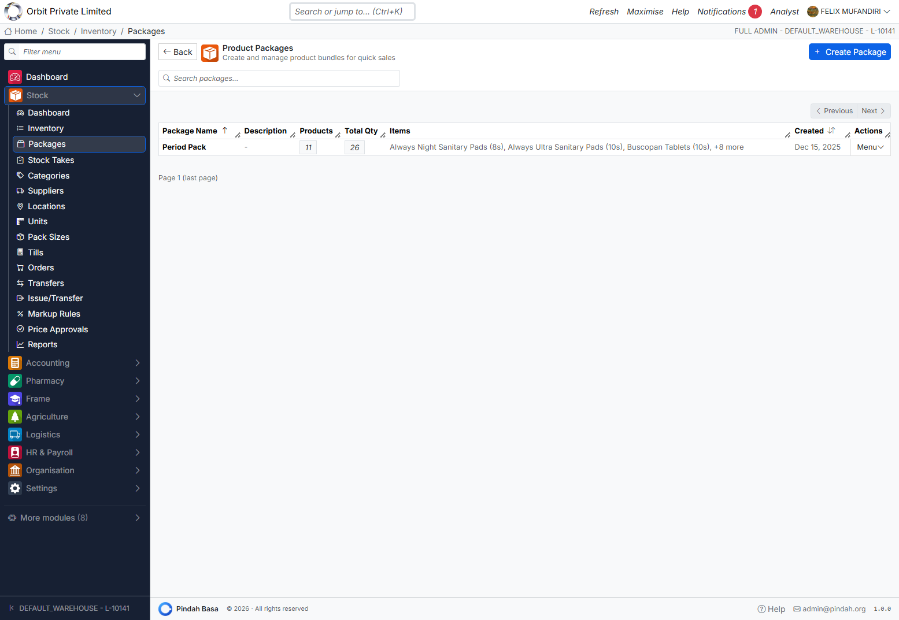

Bundles for quick POS sales (e.g. “Period Pack” with multiple lines).

1. **+ Create Package** — name, description, component products and quantities.
2. Search existing packages.
3. Row **Menu** → Edit / Delete.

Columns: Package Name, Description, Products (count), Total Qty, Items preview, Created.

---

## Categories

**Path:** Stock → Categories

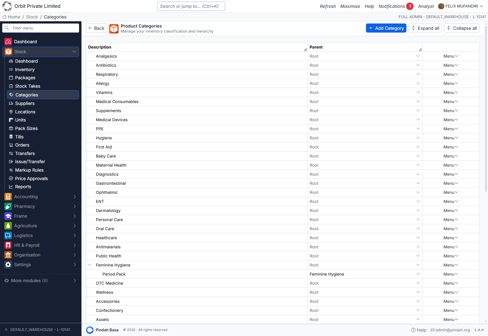

Hierarchical classification (root and child, e.g. Feminine Hygiene → Period Pack).

| Action | Purpose |
|--------|---------|
| **+ Add Category** | New category / parent |
| Expand all / Collapse all | Tree view |
| Row Menu | Edit, delete, re-parent |

Assign products to categories for filtering, markups, and reports.

---

## Suppliers

**Path:** Stock → Suppliers

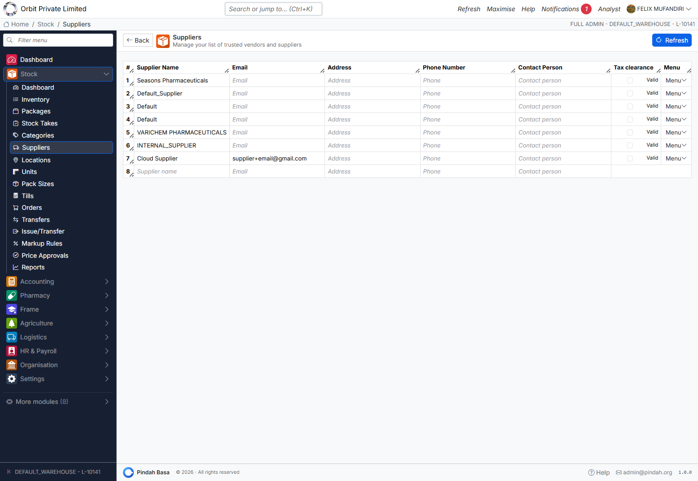

Vendor master used on receipts and products.

Inline fields: Supplier Name, Email, Address, Phone, Contact Person, Tax Clearance (Valid). Use **Refresh** to reload. Add a blank row at the bottom for a new supplier.

---

## Locations

**Path:** Stock → Locations

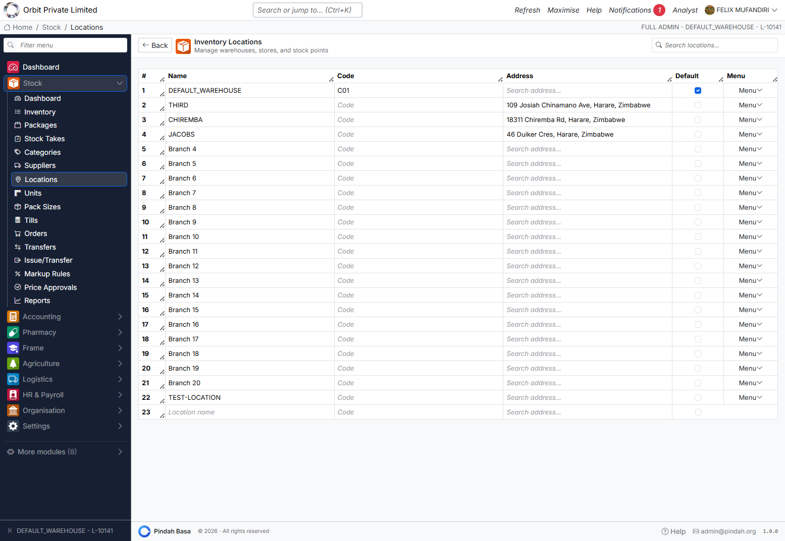

Warehouses, stores, and branches.

| Column | Notes |
|--------|-------|
| Name | e.g. DEFAULT_WAREHOUSE, Branch 4 |
| Code | Short code (e.g. C01) |
| Address | Optional |
| Default | One location marked default |

Add a new location on the empty bottom row. Every quantity and till is tied to a location.

---

## Units and Pack Sizes

**Units** (`/stock/units`) — units of measure (each, box, litre, …) assigned on products.

**Pack Sizes** (`/stock/pack-sizes`) — pack definitions for purchasing and selling in multiples.

Maintain these before bulk-loading products so codes stay consistent.

---

## Tills

**Path:** Stock → Tills

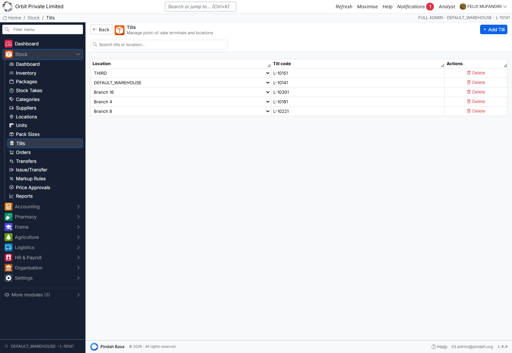

POS terminals linked to locations.

| Column | Example |
|--------|---------|
| Location | DEFAULT_WAREHOUSE |
| Till code | `L-10141` |
| Actions | Delete |

**+ Add Till** creates a terminal for a location. Accounting POS and stock issues require a till to load products and deduct stock correctly.

---

## Stock Receipts (Orders)

**Path:** Stock → Orders  
**URL:** `/stock/orders`

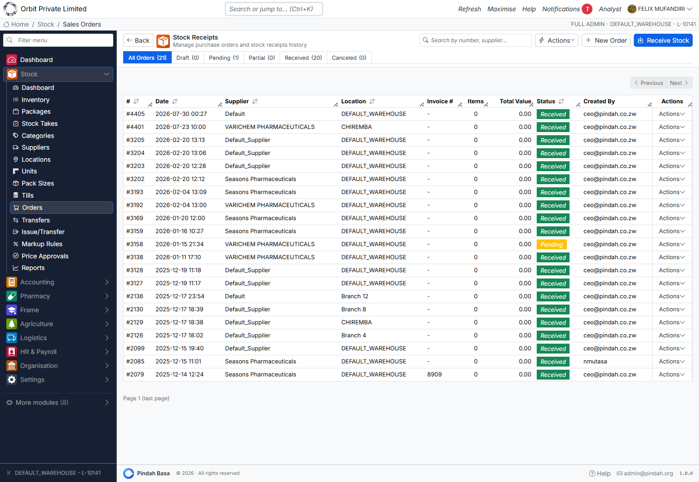

Title: **Stock Receipts** — purchase orders and receiving history.

### Status tabs

**All Orders | Draft | Pending | Partial | Received | Canceled**

### Actions

| Button | Purpose |
|--------|---------|
| **+ New Order** | Create purchase / receipt draft |
| **Receive Stock** | Open receiving flow (`/stock/orders/receive`) |
| **Actions** | Extra tools / exports |

### Columns

#, Date, Supplier, Location, Invoice #, Items, Total Value, Status, Created By, Menu.

### Receiving workflow

1. **Receive Stock** or open a Pending order → **Fulfill**.
2. Confirm location, supplier, invoice number, lines, batch/expiry if used.
3. Complete receive — stock increases; Accounting may post `GOODS_RECEIVED` when costing is present.

Statuses: **Draft → Pending → Partial → Received** (or **Canceled**).

---

## Stock Transfers

**Path:** Stock → Transfers

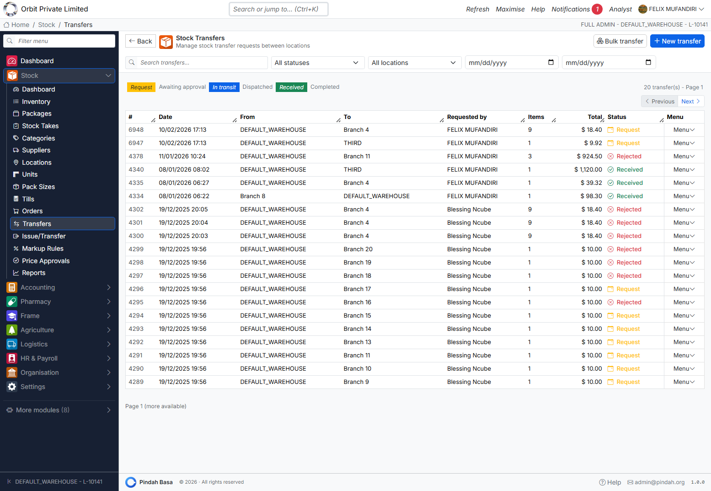

Move stock between locations with a controlled lifecycle.

### Status tabs

**Request | Awaiting approval | In transit | Dispatched | Received | Completed** (plus Rejected on rows)

### Actions

| Button | Purpose |
|--------|---------|
| **+ New transfer** | Create request (`/stock/transfers/create`) |
| **Bulk transfer** | Multi-line / multi-item transfer (`/stock/transfers/bulk`) |

### Typical flow

```
Request → Awaiting approval → In transit / Dispatched → Received → Completed
                              ↘ Rejected
```

1. Create transfer: From location/till → To location, add items.
2. Approver accepts or rejects.
3. Dispatch / mark in transit.
4. Destination **Receives** — quantities move; GL may post transfer events.

Filter by status, location, and date range. Search by transfer id.

---

## Issue / Transfer

**Path:** Stock → Issue/Transfer  
**URL:** `/accounting/sales/create/transfer`

Opens the Accounting **Issue/Transfer** (POS transfer mode) for internal stock issues without a customer sale — creates a transfer / issue request that completes through Stock transfers and stock deduction at the till’s location.

Use for: branch replenishment, internal consumption, warehouse-to-store moves when using the POS-style picker.

---

## Stock Takes

**Path:** Stock → Stock Takes

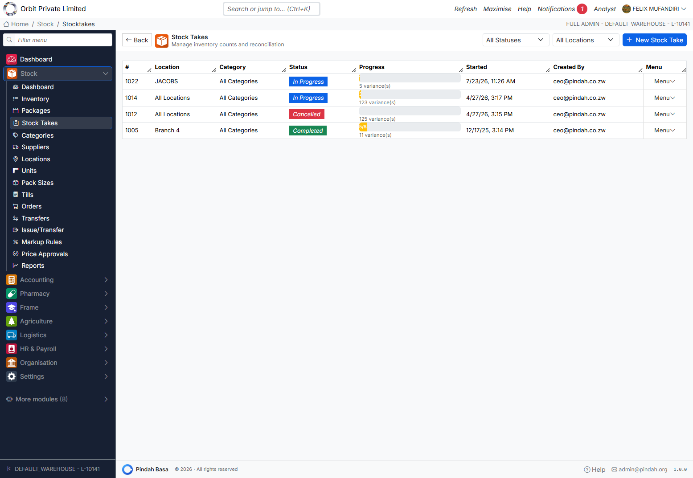

Physical counts and reconciliation.

### List

Filter **All Statuses** / **All Locations**. **+ New Stock Take**.

| Column | Meaning |
|--------|---------|
| # | Stock take id |
| Location | Branch or All Locations |
| Category | Scope of count |
| Status | **In Progress** / **Completed** / **Cancelled** |
| Progress | Variance count / progress bar |
| Started / Created By | Audit |

### Counting

1. **+ New Stock Take** — choose location (and category if offered).
2. Open count screen (`/stock/stocktakes/:id/count`).
3. Enter counted quantities (blind count / scan where enabled).
4. Review **variances**.
5. Complete — system adjusts stock; Cancel abandons without applying.

---

## Markup Rules

**Path:** Stock → Markup Rules

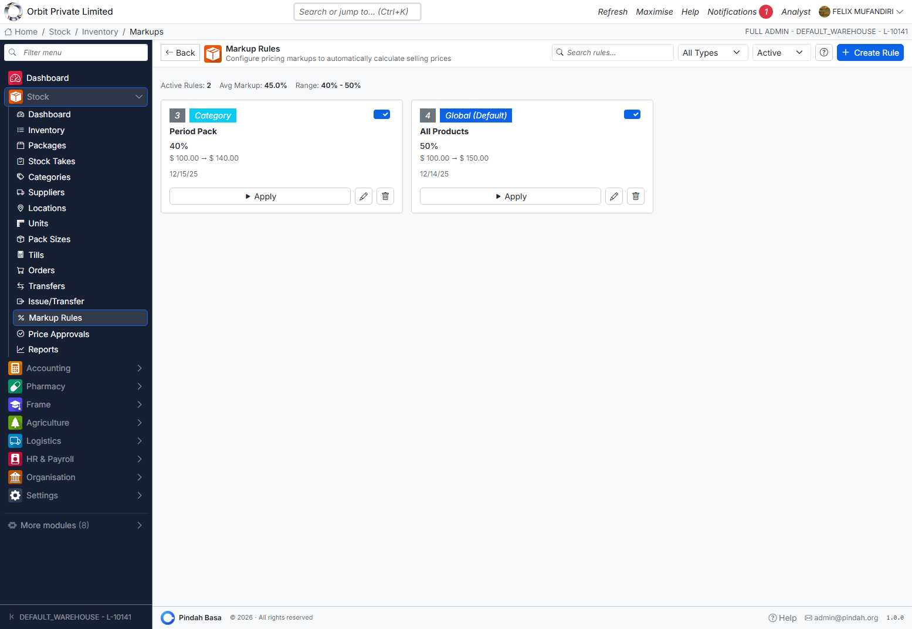

Automatic sell-price calculation from cost.

### Priority (most specific wins)

**Product → Supplier → Category → Global**

### Screen

- Search / filter by type and Active
- Stats: Active Rules, Avg Markup, Range
- Cards show type badge (Category, Global), %, price range, **Apply**, Edit, Delete
- **+ Create Rule**

After creating or changing a rule, use **Apply** so products recalculate. Resulting price changes may enter the **Price Approvals** queue.

---

## Price Approvals

**Path:** Stock → Price Approvals

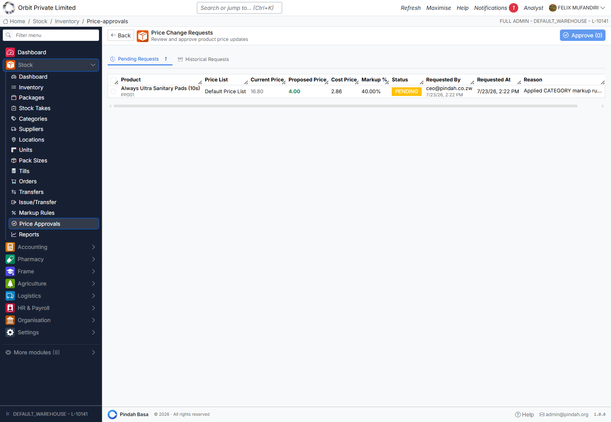

Manager review of proposed price updates.

Tabs: **Pending Requests** | **Historical Requests**

| Column | Meaning |
|--------|---------|
| Product | Name and code |
| Price List | e.g. Default Price List |
| Current / Proposed / Cost | Prices |
| Markup % | Proposed margin |
| Status | PENDING |
| Requested By / At / Reason | Audit |

Select rows → **Approve (n)** to push live. Reject via row actions where available.

---

## Reports

**Path:** Stock → Reports

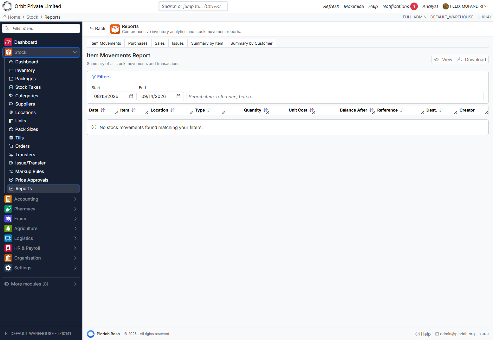

Tabs:

| Report | Purpose |
|--------|---------|
| **Item Movements** | All stock movements (default) |
| **Purchases** | Purchasing / receipt analytics |
| **Sales** | Sales by item |
| **Issues** | Issue summary |
| **Summary by Item** | Aggregated by product |
| **Summary by Customer** | Aggregated by customer |

Set Start / End dates, search item / reference / batch, then **View** or **Download**.

Movement columns typically: Date, Item, Location, Type, Quantity, Unit Cost, Balance After, Reference, Dest., Creator.

---

## How Stock Connects to Other Modules

| Module | Connection |
|--------|------------|
| **Accounting POS / Invoices** | Sales reduce stock; COGS posts to GL |
| **Accounting Purchase Orders** | Commitment; physical receive is Stock Orders |
| **Procurement** | Supplier invoices / payments after goods received |
| **Pharmacy** | Dispense draws product stock (FEFO) |
| **Organisation** | Roles gate Stock screens |

Receipts with cost feed inventory valuation and optional `GOODS_RECEIVED` journals. Transfers and write-offs can post stock GL events when Accounting is configured.

---

## Setup Guide for New Organisations

1. **Locations** — create warehouses/stores; mark one Default.
2. **Tills** — at least one till per selling location.
3. **Units** and **Pack Sizes**.
4. **Categories** (hierarchy as needed).
5. **Suppliers**.
6. **Products** — add or bulk import; set cost, sell, min/reorder.
7. **Markup Rules** — Global default, then category/product overrides; Apply.
8. **Opening stock** — via Receive Stock or opening quantity on products.
9. Smoke test: receive → POS sale → transfer → stock take → Item Movements report.

---

## Daily and Monthly Routines

### Daily

1. Confirm till / location.
2. **Receive Stock** for deliveries.
3. Process **Transfers** (approve / receive).
4. Sell via Accounting POS / Pharmacy.
5. Check Dashboard low stock and reorder proposals.

### Weekly / monthly

1. Run **Stock Take** for critical locations.
2. Clear **Price Approvals**.
3. Review NRV / dead stock on Dashboard; adjust or write down with finance.
4. Run **Item Movements** and **Purchases** reports for the period.

---

## Troubleshooting

| Situation | What to do |
|-----------|------------|
| POS has no products | Select a **Till** linked to a location with stock |
| Cannot receive stock | Ensure supplier + location exist; use Receive Stock / fulfill order |
| Transfer stuck | Check status tab — approve, dispatch, or receive at destination |
| Sell price wrong after markup | **Apply** the rule; approve pending **Price Approvals** |
| Stock take variance unexpected | Confirm location scope; recount before Complete |
| Report empty | Widen date range; clear search; confirm movements exist |
| Dashboard shows dead stock | Review Top NRV table; Menu for item actions; align with finance write-down |

---

## Support

- In-app **Help** and Guides
- Email [admin@pindah.org](mailto:admin@pindah.org)
- Web [pindah.org](https://pindah.org)
- Platform [basa.pindah.org](https://basa.pindah.org)

**Pindah Basa** · Inventory & Stock Management · © Pindah Private Limited
